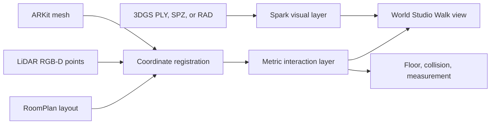

# 3DGS Walkthrough and Metric Measurement Plan

Last updated: 2026-07-12

## Objective

Make World Studio support an inside, first-person walkthrough of Gaussian splats
and ordinary point clouds on desktop and mobile. The Gaussian splat is the visual
layer. Registered LiDAR, ARKit mesh, RoomPlan, or metric point-cloud sidecars are
the basis for floors, collision, and measurements.

This distinction is mandatory: a visually plausible 3DGS is not automatically
metric, collision, semantic, or navigation authority.

## Architecture

## Existing Foundation

World Studio already provides:

- Frame, Orbit, and Free cameras;
- source-frame camera alignment;
- pointer-lock mouse look;
- gravity leveling and a Center 360 preset;
- Spark 2.1 Gaussian rendering;
- Rapier physics;
- a two-click ground-plane measurement prototype.

Capture Splat already records:

- gravity-aligned ARKit camera poses and per-frame intrinsics;
- accepted RGB-D keyframes and a continuous-video frame index;
- metric LiDAR depth and confidence;
- a classified ARKit triangle mesh;
- RoomPlan USDZ and semantic proposals;
- capture-path length, loop status, overlap, and tracking evidence.

## Current Gaps

1. World Studio measurements currently intersect an artificial `y = 0` plane.
2. Spark splat raycasting is enabled but is not used for picking.
3. Rapier currently approximates OBJ groups with bounding boxes instead of using
   a walkable triangle mesh and a character controller.
4. The Capture Splat handoff does not carry the ARKit mesh, mesh report,
   RoomPlan semantics, continuous camera trajectory, or measurement points.
5. The ARKit, COLMAP, trainer, and World Studio coordinate frames are not yet
   expressed as one validated transform chain in the handoff.
6. Large Gaussian PLY files are loaded monolithically instead of using paged LoD.

## Execution Phases

### Phase 1: Metric Handoff and Registration

Extend `capture-splat.world-studio.json` additively with:

- `assets.navigation_mesh`;
- `assets.mesh_report`;
- `assets.room_semantics`;
- `assets.camera_trajectory`;
- `assets.measurement_points`, when available;
- a strict metric-registration report.

The registration report must describe:

- `arkit_world -> colmap_world` camera-center Sim(3);
- `colmap_world -> trainer_world` trainer transform;
- the composed `arkit_world -> trainer_world` matrix;
- units and up axis;
- matched camera count;
- median and p95 residuals;
- residuals relative to scene radius;
- `accepted`, `held`, or `unavailable` status.

World Studio must ingest these references and state one of:

- `Walk eligible - registered metric mesh`;
- `Fly only - metric registration held`;
- `Fly only - metric geometry missing`.

RoomPlan data captured in a separate session remains an unregistered semantic
proposal until a separate RoomPlan-to-ARKit registration is validated.

### Phase 2: Walk and Fly Cameras

Expose four camera roles:

- **Frame**: exact selected source-camera evidence;
- **Orbit**: external asset inspection around a target;
- **Walk**: eye-height, gravity-constrained, collision-aware navigation;
- **Fly**: unrestricted first-person inspection.

Walk uses a Rapier kinematic capsule with:

- approximately 1.6 m eye height;
- delta-time movement, acceleration, damping, and speed limits;
- a locked horizon with roll disabled;
- slope limits, stair stepping, and snap-to-ground;
- collision against registered triangle geometry;
- explicit fallback to Fly when metric geometry is unavailable.

Desktop input uses pointer-lock mouse look and WASD/arrow movement. Mobile uses
a left movement control, right-side look drag, and optional tap-to-move. Input
must be continuous and frame-rate independent rather than one large jump per key.

### Phase 3: Surface-Backed Measurement

Move the ruler into Simulate, Walk, and Fly. Support:

- point-to-point distance;
- vertical height;
- polyline length;
- polygon area.

Picking priority is:

1. registered metric triangle mesh;
2. registered metric RGB-D point cloud;
3. Gaussian intersection as a labeled visual estimate.

Gaussian raycasting runs only on click or tap. It must not run every frame.
Measurements are written to `world_studio_measurements.json` with:

- points in the declared coordinate frame;
- units;
- measurement type and value;
- source asset path and checksum;
- registration status;
- basis and uncertainty;
- visual-estimate warning when no metric source was used.

### Phase 4: Large-Asset Loading

For Gaussian assets:

- retain the source PLY or SPZ as evidence;
- prebuild Spark quality LoD assets;
- use chunked `.rad` plus paged loading for large scenes;
- select a splat budget from measured device performance;
- report source splats, resident splats, visible splats, and frame time.

For ordinary point clouds:

- keep direct PLY loading for bounded fixtures;
- evaluate a Potree/COPC-style octree adapter for large assets;
- keep point-cloud and Gaussian delivery formats separate.

True progressive loading must not be claimed while the entire source PLY is
still read into browser memory.

### Phase 5: iPhone Walkthrough Capture Evidence

Build on the existing Room/Walkthrough intent. Add:

- a lightweight continuous ARKit camera trajectory;
- floor and walkable-path coverage;
- classified-mesh coverage;
- doorway crossings and return-path evidence;
- maximum path separation and loop completion;
- guidance for missing floor, doorway, side-parallax, and return coverage.

Recommended capture path:

1. Begin near eye height with a clear floor view.
2. Walk the perimeter slowly.
3. Cross the room diagonally in both directions.
4. Pass through each doorway in both directions.
5. Add side-facing passes along walls and furniture.
6. Add a short lower pass for floor and furniture contact edges.
7. Return to the starting area for loop closure.
8. Run RoomPlan after the appearance capture.

Avoid pure in-place rotation, fast turns, large exposure changes, and long
straight paths without side parallax.

## Test Assets

Use this progression:

1. Capture Splat room, about 141 MB and 627k Gaussians.
2. iPhone RGB-D cloud, about 143 MB and 3.1M points.
3. DL3DV Gaussian scene, about 599 MB.
4. Lublin city Gaussian, about 5.6 GB and 106M splats.
5. Lublin full asset, about 16 GB, only after paged LoD passes.

Bonsai remains an object Orbit and visual-rendering regression asset. It is not
a metric room-walkthrough test.

## Evidence Gates

- The floor is level and the horizon does not roll in Walk.
- Walk begins from a recorded, registered camera location inside the scene.
- The camera does not pass through registered walls or fall through floors.
- Every measurement reports its geometry source, coordinate frame, and units.
- Known-length checks are compared with LiDAR or RoomPlan references.
- Desktop and mobile frame time are reported separately.
- Large assets become interactive without loading the full source PLY first.
- Missing or held metric evidence produces `Fly only`, never a Walk claim.

## Progress Ledger

| Phase | Status | Evidence | Next gate |
| --- | --- | --- | --- |
| Research and repo audit | Complete | Video inspected; current World Studio and Capture Splat paths audited; Spark, Rapier, Potree, and Apple references reviewed | Preserve findings in code contracts |
| 1. Capture Splat metric handoff | Complete; physical registration passed | Fresh Room Walkthrough handoff has 168 matched RGB-D cameras, accepted metric registration, a 156,969-point seed, ARKit mesh, and trajectory evidence | Visualize the registered mesh without promoting collision authority |
| 1. World Studio metric ingestion | Complete; camera and floor accepted | The 7000 review package loads, Frame cameras align, Inside/360 stay level, and keyboard motion is controlled | Render and verify the registered navigation mesh |
| 2. Walk and Fly cameras | Pending | Frame, Orbit, Free, pointer lock, gravity leveling, and Center 360 already exist | Add collision-aware Walk |
| 3. Surface measurement | Pending | Ground-plane ruler exists; Spark raycasting is enabled | Add metric raycast and annotation export |
| 4. Large-asset LoD | Pending | Spark 2.1 is installed; large local fixtures are available | Add RAD preparation and paged loading |
| 5. iPhone walkthrough evidence | In progress | Fresh capture finalized 168 RGB-D keyframes and a 6,831-frame trajectory with finite classified mesh evidence | Activate room-intent guidance and collect RoomPlan semantics |
| Final validation | Pending | Evidence gates defined above | Pass desktop, mobile, metric, and large-asset gates |

## Progress Notes

### 2026-07-10 - Phase 1 Metric Contract

Capture Splat:

- Added optional public handoff inputs for navigation mesh, mesh report,
  RoomPlan semantics, continuous trajectory, and measurement points.
- Added automatic sidecar discovery from iPhone `capture.json`.
- Reused the RGB-D seed camera-center alignment to estimate the
  `arkit_world -> colmap_world` Sim(3).
- Composed the trainer transform and emitted target-units-per-meter and
  meters-per-target-unit.
- Added `eligible`, `held`, and `missing` Walk decisions while keeping top-level
  collision and navigation authority false.
- Validation: Python compileall passed; all 143 pytest tests passed; diff and
  public private-string checks passed.

World Studio:

- Added typed Capture Splat metric handoff fields.
- Added reader support for binary navigation mesh and measurement points plus
  mesh report, RoomPlan semantics, continuous trajectory, registration, and
  Walk eligibility.
- Added the metric interaction decision to package insights.
- Validation: all 52 Vitest tests passed; monorepo typecheck passed; diff check
  passed.

Remaining Phase 1 evidence gate:

- Export a package from a fresh physical iPhone capture and confirm that the
  real camera-center registration is accepted. Unit fixtures prove the contract
  and decision behavior, not physical alignment quality.

### 2026-07-11 - iPhone Stability Gate Before Fresh Capture

The walkthrough lane remains paused after Phase 1. Xcode reproduced an
Objective-C exception in the continuous-video recorder because its pixel-buffer
adaptor was created after the asset-writer input had started writing. Capture
Splat now creates the adaptor before `startWriting()`, owns the AR session
configuration explicitly, records AR session failures and interruptions, and
uses valid SF Symbols. The unsigned physical-device target builds successfully.

One physical Desk / Cluster pass then finalized without the previous exception:
6,179 continuous-video frames, 93 RGB-D keyframes, 132 person masks, and a
finite ARKit mesh were preserved. The host quality report returned `promote`,
and corrected full-resolution preparation produced a `ready` 300-frame
package with complete camera metadata. This is a useful Orbit/reconstruction
fixture, not the room-walkthrough registration proof.

The corrected build was subsequently installed and completed fresh Desk /
Cluster and Object Orbit Record -> Stop -> Finalize passes without a recorder
crash. Their continuous-video writers reported zero dropped frames and startup
latencies remained below 0.04 seconds. Both long passes reached a `serious`
thermal state, and Xcode retained-frame telemetry still needs to be checked
explicitly before treating recorder stability as fully closed.

The Desk and Object exports are useful reconstruction fixtures, but they do not
satisfy the physical room-registration gate. Before resuming Phase 2:

1. confirm the corrected build no longer emits the retained-`ARFrame` warning;
2. make a fresh Room Walkthrough capture;
3. export a World Studio handoff with trajectory and navigation mesh evidence;
4. validate real camera-center registration, scale, floor orientation, and
   metric mesh placement.

After those checks, resume here with navigation-mesh parsing and the
collision-aware Walk camera. Do not redo the completed Phase 1 handoff or
ingestion work.

### 2026-07-12 - Fresh Room Registration Evidence

The fresh Room Walkthrough export finalized without a recorder crash. It
contains 168 accepted RGB-D keyframes, 6,831 continuous-video frames with zero
writer drops, 40 person masks, and a finite classified ARKit mesh with 172,716
vertices and 300,000 triangles. Host capture QA returned `promote`, and
preparation produced a 300-frame package with complete per-frame camera and
mask evidence. The device reached a `serious` thermal state. RoomPlan semantics
were not exported, and room-specific overlap/loop guidance remained idle
because the scan target stayed in the shared Video 3DGS mode.

On an A100, pinned HLOC NetVLAD top-32 retrieval, ALIKED-N16, LightGlue, and the
integrated COLMAP global mapper registered 291 of 300 prepared images. One
continuous-video image, `000064.jpg`, had zero registered points and an extreme
camera center. The original model is preserved; a derived model deregistered
only that frame and retained 290 cameras and 24,387 sparse points. A separate
168-RGB-D-only global model registered every image but failed the physical
camera-center residual gate, so registration count alone did not promote it.

The filtered 290-camera model matched all 168 authoritative RGB-D cameras with
a median residual of 0.163 COLMAP units (2.81% of scene radius) and p95 residual
of 0.336 (5.77%). The metric seed contains 156,969 confidence-filtered points.
The exported World Studio handoff reports accepted metric registration and
eligible metric mesh evidence while retaining false collision, navigation,
semantic, and quality authority. This closes the physical Phase 1
camera-center registration gate. It does not yet prove correct floor
orientation, mesh placement, collision-safe Walk behavior, or trained 3DGS
quality.

### 2026-07-12 - A100 3DGS Review Proposal

The same filtered 290-camera metric package was trained at full resolution on
an A100 with gsplat and bilateral-grid post-processing. All three outputs are
finite. Strict raw source/render QA used the same 37 held-out cameras:

| Rung | Splats | Mean PSNR | Mean SSIM | Mean MAE | Weak frames | Decision |
| --- | ---: | ---: | ---: | ---: | ---: | --- |
| 3000 | 683,558 | 23.149 | 0.9429 | 0.04926 | 6 | Hold |
| 7000 | 1,226,209 | 23.510 | 0.9500 | 0.04963 | 5 | Hold; selected review proposal |
| 15000 | 1,612,183 | 23.781 | 0.9491 | 0.04906 | 5 | Hold; individual regressions |

The 15000 rung improved aggregate PSNR but regressed four individual cameras,
including large SSIM/correlation drops on prepared frames `000218` and
`000226`; its maximum splat radius also rose from 0.59 to 3.01. The controlled
ladder therefore stopped before 30000. This is a quality-gate decision, not a
claim that longer training can never help.

For interactive review, alpha pruning retained 601,786 finite 7000-rung
splats and dropped 50.9% near-transparent splats, below the 60% refusal gate.
The standalone handoff is
`room_walkthrough_world_studio_gsplat_7000_pruned_review`: 300 source frames,
168 matched metric cameras, accepted metric registration, eligible metric
mesh evidence, and 310 verified file checksums. The splat remains a visual
review proposal; collision, navigation, semantic, and quality authority are
all false. The next World Studio gate is visual floor orientation and mesh
placement, followed by collision-aware Walk.

### 2026-07-12 - World Studio Visual Acceptance

The selected 7000 review package initially failed to open because its ordinary
metric `points.ply` was binary little-endian. World Studio now converts binary
ordinary PLYs into capped ASCII previews while preserving the source file size
and checksum. Capture Splat metric points are mapped through the handoff
dataparser transform only when the manifest identifies them as COLMAP-world
measurement evidence.

Frame mode visually matches the selected source camera. Free, Inside, and 360
now use the accepted ARKit-to-trainer up vector instead of treating portrait
image-camera up as gravity, and generated first-person presets use the same
OpenCV camera convention as COLMAP. The doorway and wall edges remain level
during 360 rotation, and one-step W/arrow input remains controlled.

The classified ARKit navigation mesh is finite and present, but World Studio
does not yet render its binary PLY. Mesh placement therefore remains held, and
collision-aware Walk and metric measurement must not start until a separate
non-authoritative evidence-mesh path verifies overlap with the splat.

## Reference Boundaries

- Spark remains World Studio's Gaussian renderer.
- Rapier remains the browser physics engine.
- Potree is an evaluation reference for ordinary large point clouds.
- AHOLO patterns inform navigation and LoD UX but are not a runtime dependency.
- Source frames remain visual evidence.
- Trained splats remain review proposals unless separate metric evidence is
  registered and validated.
