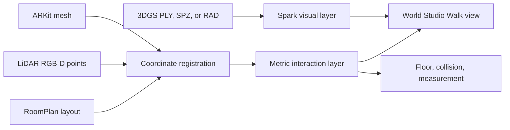

# 3DGS Walkthrough and Metric Measurement Plan

Last updated: 2026-08-21

## Objective

Make World Studio support an inside, first-person walkthrough of Gaussian splats
and ordinary point clouds on desktop and mobile. The Gaussian splat is the visual
layer. Registered LiDAR, ARKit mesh, RoomPlan, or metric point-cloud sidecars are
the basis for floors, collision, and measurements.

This distinction is mandatory: a visually plausible 3DGS is not automatically
metric, collision, semantic, or navigation authority.

## Architecture

```mermaid
flowchart LR
    A["3DGS PLY, SPZ, or RAD"] --> V["Spark visual layer"]
    B["ARKit mesh"] --> R["Coordinate registration"]
    C["LiDAR RGB-D points"] --> R
    D["RoomPlan layout"] --> R
    R --> M["Metric interaction layer"]
    V --> W["World Studio Walk view"]
    M --> W
    M --> X["Floor, collision, measurement"]
```

## Existing Foundation

World Studio already provides:

- Frame, Orbit, and Free cameras;
- source-frame camera alignment;
- pointer-lock mouse look;
- gravity leveling and a Center 360 preset;
- Spark 2.1 Gaussian rendering;
- Rapier physics;
- a two-click ground-plane measurement prototype.

Capture Splat already records:

- gravity-aligned ARKit camera poses and per-frame intrinsics;
- accepted RGB-D keyframes and a continuous-video frame index;
- metric LiDAR depth and confidence;
- a classified ARKit triangle mesh;
- RoomPlan USDZ and semantic proposals;
- capture-path length, loop status, overlap, and tracking evidence.

## Current Gaps

1. World Studio measurements currently intersect an artificial `y = 0` plane.
2. Spark splat raycasting is enabled but is not used for picking.
3. Rapier currently approximates OBJ groups with bounding boxes instead of using
   a walkable triangle mesh and a character controller.
4. Capture Splat metric sidecars are ingested, but the registered ARKit mesh is
   still review evidence rather than collision or measurement authority.
5. The July Room Walkthrough handoff has an accepted ARKit-to-trainer transform chain;
   packages without accepted registration remain Fly-only. The current Spirula iPhone proposal
   has no validated trainer-to-metric transform and is therefore also Fly-only.
6. Large Gaussian PLY files are loaded monolithically instead of using paged LoD.
7. Strict 3DGS job/asset/benchmark contracts now exist, but no production trainer is
   registered and no contract output is loaded into Spark or a canonical World automatically.

## Execution Phases

### Phase 1: Metric Handoff and Registration

Extend `capture-splat.world-studio.json` additively with:

- `assets.navigation_mesh`;
- `assets.mesh_report`;
- `assets.room_semantics`;
- `assets.camera_trajectory`;
- `assets.measurement_points`, when available;
- a strict metric-registration report.

The registration report must describe:

- `arkit_world -> colmap_world` camera-center Sim(3);
- `colmap_world -> trainer_world` trainer transform;
- the composed `arkit_world -> trainer_world` matrix;
- units and up axis;
- matched camera count;
- median and p95 residuals;
- residuals relative to scene radius;
- `accepted`, `held`, or `unavailable` status.

World Studio must ingest these references and state one of:

- `Walk eligible - registered metric mesh`;
- `Fly only - metric registration held`;
- `Fly only - metric geometry missing`.

RoomPlan data captured in a separate session remains an unregistered semantic
proposal until a separate RoomPlan-to-ARKit registration is validated.

### Phase 2: Walk and Fly Cameras

Expose four camera roles:

- **Frame**: exact selected source-camera evidence;
- **Orbit**: external asset inspection around a target;
- **Walk**: eye-height, gravity-constrained, collision-aware navigation;
- **Fly**: unrestricted first-person inspection.

Walk uses a Rapier kinematic capsule with:

- approximately 1.6 m eye height;
- delta-time movement, acceleration, damping, and speed limits;
- a locked horizon with roll disabled;
- slope limits, stair stepping, and snap-to-ground;
- collision against registered triangle geometry;
- explicit fallback to Fly when metric geometry is unavailable.

Desktop input uses pointer-lock mouse look and WASD/arrow movement. Mobile uses
a left movement control, right-side look drag, and optional tap-to-move. Input
must be continuous and frame-rate independent rather than one large jump per key.

### Phase 3: Surface-Backed Measurement

Move the ruler into Simulate, Walk, and Fly. Support:

- point-to-point distance;
- vertical height;
- polyline length;
- polygon area.

Picking priority is:

1. registered metric triangle mesh;
2. registered metric RGB-D point cloud;
3. Gaussian intersection as a labeled visual estimate.

Gaussian raycasting runs only on click or tap. It must not run every frame.
Measurements are written to `world_studio_measurements.json` with:

- points in the declared coordinate frame;
- units;
- measurement type and value;
- source asset path and checksum;
- registration status;
- basis and uncertainty;
- visual-estimate warning when no metric source was used.

### Phase 4: Large-Asset Loading

For Gaussian assets:

- retain the source PLY or SPZ as evidence;
- prebuild Spark quality LoD assets;
- use chunked `.rad` plus paged loading for large scenes;
- select a splat budget from measured device performance;
- report source splats, resident splats, visible splats, and frame time.

For ordinary point clouds:

- keep direct PLY loading for bounded fixtures;
- evaluate a Potree/COPC-style octree adapter for large assets;
- keep point-cloud and Gaussian delivery formats separate.

True progressive loading must not be claimed while the entire source PLY is
still read into browser memory.

### Phase 5: iPhone Walkthrough Capture Evidence

Build on the existing Room/Walkthrough intent. Add:

- a lightweight continuous ARKit camera trajectory;
- floor and walkable-path coverage;
- classified-mesh coverage;
- doorway crossings and return-path evidence;
- maximum path separation and loop completion;
- guidance for missing floor, doorway, side-parallax, and return coverage.

Recommended capture path:

1. Begin near eye height with a clear floor view.
2. Walk the perimeter slowly.
3. Cross the room diagonally in both directions.
4. Pass through each doorway in both directions.
5. Add side-facing passes along walls and furniture.
6. Add a short lower pass for floor and furniture contact edges.
7. Return to the starting area for loop closure.
8. Run RoomPlan after the appearance capture.

Avoid pure in-place rotation, fast turns, large exposure changes, and long
straight paths without side parallax.

## Current Benchmark Fixtures

The contract benchmark allowlist is exactly:

1. NeRF Synthetic Lego at
   `/Users/dev/Library/CloudStorage/OneDrive-Personal/smallFoundationModel-data/datasets/nerf_synthetic/scenes/nerf_synthetic/lego`.
2. Original-3DGS Deep Blending Playroom staged at
   `/Users/dev/Desktop/smallFoundationModel/data/generated/world_studio_3dgs_fixtures_20260821/db/playroom`
   from the OneDrive `datasets/3dgs_original/archives/tandt_db.zip` source archive.
3. The local iPhone lane rooted at
   `/Users/dev/Downloads/capture_splat_2026-08-09T060230Z`, with 122 accepted RGB-D source
   frames and a checksum-bound 300-image real-SfM package staged at
   `/Volumes/WorldStudio-3DGS-TestData/world-studio-capture-splat-tests/capture/sfm/iphone060230-global-hloc-real-a077533f-r3-complete-v2`.

Lego is metadata-first until its manifest and referenced-byte completeness is revalidated.
Playroom is byte- and COLMAP-reference-complete for private local benchmark evaluation but
remains held for redistribution, public demos, product use, and commercial use because no
dataset-byte license was located.
The local iPhone capture is the capture-to-training integration fixture.
All other OneDrive datasets, including Bonsai, DL3DV, and Lublin, stay cloud-only and outside
the active benchmark matrix. This contract slice does not hydrate or offload anything.

Current local evidence, scoped to these exact artifacts rather than upstream constants:

- the staged Lego manifest inventories 803 files with SHA-256
  `21454ce25a35b567d0701bff615914497df93af1ed80949763ae7c9b25189f3d`;
- the staged Playroom checksum list inventories 229 files and hashes to
  `bc23594180b9226dc5bacb4313e6036869d95c56d36d420666fea884f61f8eb6`;
  its local sparse metadata reports
  225/225 registered images, one `PINHOLE` camera, 37,005 points, and 0.616264 px mean
  reprojection error. Its first-class dataset manifest hashes to
  `494b7f8f069292f6b08497cbd8d820112c69677046ce39fd3c7e6268d4d8dc36`
  and binds the GraphDeco-INRIA-distributed T&T+DB archive SHA-256 plus exact 229/229 member
  parity;
- the historical pre-SfM iPhone v0.3 probe uses capture profile `video_3dgs_max` and inventories 122
  frames with training-frame digest
  `sha256:9fa6cc5c8447be6a4f58a7d61b97bc15b584711454468a66fb65f1300c51875c`
  and handoff SHA-256
  `bb53d2c713fc9240d4750182e6c8b6032e75d2c3fbb51d90482bdd1b38f844c1`.

The staged Lego inventory remains metadata-first until referenced-byte completeness is
revalidated. Playroom completeness does not clear dataset rights or prove trainer consumption
or reconstruction quality. The historical v0.3 iPhone values validate only that earlier local
handoff's capture-evidence binding; current real-SfM, training, and self-contained-handoff
evidence is recorded below and remains subject to its own authority gates.

The pinned Spirula Playroom run preserves the arbitrary COLMAP/SfM gauge. Its Gaussian asset
therefore records unknown length units and null up/forward axes and remains visual-only; no
measurement, collision, navigation, or physics use is allowed without separate accepted
metric registration. Spirula qlevel 1 uses mixed training storage (including quantized SH
and optimizer state), but checkpoint export dequantizes PLY properties to float32. The job
records mixed training-storage quantization while the exported PLY asset records no serialized
quantization; this is not evidence of compressed delivery.

### Measured Playroom Apple quality ladder and Spark gate - 2026-08-21

The first disk-cache evaluation ladder is rejected: Spirula's asynchronous disk decode path
repeated held-out views, leaving only five to seven unique cameras in an eight-camera set. The
superseding CPU-cache contract requires the same unordered eight-image GT hash set in every run.
All four corrected exploratory rungs and three corrected 7,000-step repetitions passed that
gate, produced eight unique renders, and had finite PLY payloads.

On the exact Apple M2 Max host, the corrected exploratory ladder measured:

| steps | splats | PSNR | SSIM | LPIPS Alex | process elapsed | max RSS |
| ---: | ---: | ---: | ---: | ---: | ---: | ---: |
| 500 | 36,593 | 21.6994 | 0.792177 | 0.469052 | 18.76 s | 1,008,893,952 B |
| 1,000 | 44,651 | 23.3253 | 0.820748 | 0.390421 | 33.79 s | 1,004,994,560 B |
| 3,000 | 99,912 | 26.3961 | 0.861971 | 0.289709 | 99.70 s | 1,005,518,848 B |
| 7,000 | 100,000 | 27.8425 | 0.883883 | 0.239737 | 237.74 s | 1,005,142,016 B |

Three warm 7,000-step repetitions measured median/p95 process elapsed time of
238.42/254.93 seconds and median/p95 maximum RSS of 1,009,696,768/1,012,547,584 bytes.
MPS LPIPS completed without CPU fallback. Because the trainer exposes no seed, only one scene
was measured, and only the selected rung was repeated, these are bounded host observations and
not a promoted World Studio quality claim.

The next Spark asset is `playroom-fx-q7000-w3`: 100,000 splats, 24,801,531 bytes, zero
non-finite values, and PLY SHA-256
`12379d273214e5370e92c36f8e0cfe8761977ab5c10b1a83f9a371c5912a067b`. The checksum-bound
benchmark report is
`data/generated/world_studio_3dgs_quality_ladder_20260821/aede0ae3/evidence/playroom-quality-ladder-benchmark-report.v0.1.json`
with SHA-256 `a909eb2a9bc0cd2cd3d43287b0e9146e77765aa2084b75ee3b311ba76c256c45`.

The earlier 37,005-splat development probe identified off-centre framing and a passive wheel
listener warning. Robust bounded framing, non-periodic preview sampling, and the interaction
regression are now covered by unit, package-reader, and Playwright tests. Exact baseline
`7e47718cbd644e3e69272389fc1d2b389342bc60` and candidate
`3ea410791bdfb23eaac6cb85dfd7acb88f1a5d2e` packages were then built on a separate,
quota-limited external APFS test volume and loaded with Spark 2.1.0 against the nominated
100,000-splat PLY.

The baseline is rejected: it emitted the passive-wheel console error and its raw-extrema
camera frame left the initial canvas blank/off-scene. The candidate is promoted for the
bounded functional gate only: it showed the exact
`spark gaussian · world-studio-default · 100000 splats` status and source provenance,
rendered the scene centred on first load, preserved a visible scene after orbit/zoom, and
produced no observed post-attachment console warning, console error, or page error. The
external-relative diagnostic report
`spark/runs/20260821-spark-functional-diagnostic-v0.3/spark-production-load-smoke.v0.3.json`
has SHA-256 `cc038b5ac9ab9cf5a69a0ba859c98344a9e1da35c9389bd6599a73bcdeaf8821`;
`spark/evidence/world-studio-spark-functional-decision.v0.1.json` has SHA-256
`59404b227647f48a544bb52ee7c93427d86b4e33e085b9b9ef61fc7994b41a60`.

The harness intentionally stopped before measurement because the baseline workload was not
functionally equivalent, so measured pairs remain zero. First-visible latency, draw time,
memory, and comparative performance remain held; external USB I/O, unavailable thermal
telemetry, and absent app-side present/draw/GPU-memory instrumentation also prevent promotion.
Metric measurement, collision, navigation, and Newton physics remain separate unpassed gates.

### iPhone real SfM, Spirula v5, and self-contained handoff - 2026-08-21

The same external workspace prepared the finalized local capture into 300 SfM inputs: 122
accepted RGB-D frames plus 178 bounded video supplements, with 300 valid masks. The real r3
pipeline then ran global NetVLAD top-32 retrieval, ALIKED-N16 extraction, LightGlue matching,
mask filtering, geometric verification, COLMAP mapping, and orientation alignment. The finite
model registered 300/300 images, contains 14,888 sparse points and 321,782 observations, and has
1.2636579 px mean reprojection error. The run contract SHA-256 is
`327ada298a466bdf82faa9ffd730b59ff494bebe4241914b9373572c23e7d1db`; strict validation SHA-256
is `1b9926601b7330a7c8b54572ec4509979cd88a143a44e9514047b12855ad9c7d`.
Registration evidence is promoted, but quality, metric scale, and production timing are not.

The immutable raw r3 output remains preserved. A separate complete-v2 derived package copied
the missing companion evidence without mutating it and verified all 852 `capture.json`
references. Its `capture.json` SHA-256 is
`2c774f4b77855edaa4712ce90a4a4ab04680b9c1fb577a1c7d74a3435cd76f5c`, its payload-tree SHA-256
is `da487746dd8f7c34d2fba5f0d42e614bd17005ce9f685dc75dab5197497965d6`, and its completeness
report SHA-256 is `346488ce19588260f649b2b2ea72028596d37a5b91c3fdd5c4f6b25ef2d5217d`.

Pinned Spirula revision `aede0ae3b2d01a7930c71b9c7f52354dc180146b` then ran the v5
Apple M2 Max ladder with CPU image caching, interval evaluation over 38 held-out cameras, MPS
LPIPS, masks, SH3, qlevel 1 training storage, bilateral grid, and PPISP:

| steps | serialized splats | PSNR | SSIM | LPIPS Alex | process elapsed | max RSS |
| ---: | ---: | ---: | ---: | ---: | ---: | ---: |
| 500 | 14,869 | 19.7974 | 0.771698 | 0.447210 | 65.29 s | 3,208,118,272 B |
| 1,000 | 17,632 | 21.1260 | 0.792117 | 0.398180 | 132.36 s | 3,207,905,280 B |
| 3,000 | 46,334 | 23.3286 | 0.839514 | 0.280702 | 240.57 s | 3,219,341,312 B |
| 7,000 | 99,967 | 24.6216 | 0.867374 | 0.209928 | 538.83 s | 3,214,426,112 B |

Three fresh 7,000-step repetitions measured median/p95 elapsed time of 540.33/552.75 seconds
and median/p95 maximum RSS of 3,214,573,568/3,215,708,979.2 bytes. These are external-USB,
unseeded host observations with unavailable thermal and device-memory telemetry, not promoted
performance. Canonical GT v0.2 binds the fixed 38 camera names and an unordered GT hash set;
each run separately records its ordered GT/render pairs and explicitly exposes no camera-name to
GT-hash association.

The result selected fresh repetition `repeat-000007000-02` for the next functional gate: PSNR
24.6459, SSIM 0.868393, LPIPS Alex 0.209897, and a finite 99,979-splat PLY with SHA-256
`207edbe4020c9e7ba60fa836a2d66c7012d53a26eb99b7265d05075e6ac6759e`. The selected validation
v0.2 SHA-256 is `81e6cc932e623c17485498f38b78a7c3e5887c827a7d4017061de4a27f33d4bd`;
the ladder-result SHA-256 is `d64938544b19ca6314001547b3f0d20a418a2cd058da68f438b7fe9f427580d0`.
Its decision is `ready_for_spark_functional_gate`, not a quality promotion.

Capture Splat revision `be7f6ff8bff614945cd82c3512059e8c433f2d02` exported a fresh,
self-contained v0.3 handoff. It includes every one of the 852 dataset references plus the
manifest, COLMAP text model, selected Gaussian, and declared companions: 865 files, 864 declared
references, and no undeclared files. The manifest SHA-256 is
`bbb356294d4ee3373036310cc4f1aecd3001e5b861f3c063769ea6696d8a596d`; the handoff tree SHA-256
is `7d74c665d5866bf0db6f845b074fbd065bb715d7a0ef97f07c1723552e0bb45b`; strict validation
SHA-256 is `0ceef27fb8555ddde47dedd29ed22cfee4668e5efa3b21e90cd91f23de73f1c5`.
The selected Gaussian remains a trainer-world visualization proposal with no validated
trainer-to-metric transform. Metric measurement, collision, navigation, quality, and physics
authority are false.

The exact packaged candidate-only Spark 2.1 r6 functional run completed. Its immutable automated
report is external-relative
`spark/runs/iphone060230-candidate-functional-v0.1-r6/spark-candidate-functional.v0.1.json`,
SHA-256 `ace2c7580129bfc6b59b434ee1f4396e72949cf2a130dcc2e391d8085654cbe9`; the sibling
`spark-candidate-manual-visual-review.v0.1.json` has SHA-256
`7e55e53acb1396f031a2224bfa8437d5d4ad41765d115304bb8761b8d65a3ba1`. Harness SHA-256 is
`02e3358b60322f1087d4fd3959afa71ea37104fbbec1037c8fd7339c4147021a`.
The report binds the exact packaged candidate/revision/renderer URL, dedicated APFS workspace,
idle Time Machine state, immutable ladder and selected validation/PLY, complete v0.3 handoff
preflight/postflight, sanitized override environment, displayed package kind/loaded-via/status/
provenance, seven screenshots, three distinct camera-response canvas hashes, and process-group
cleanup. The exact displayed status is
`spark gaussian · capture-splat-generic · 99979 splats`.

Manual review promotes only functional scene visibility, material orbit response, and material
inward-zoom response. It also records visible smearing and blur, floating Gaussian structure,
poorly resolved surfaces, 11,452 scales clamped, and 9 outliers hidden. Native render evidence is
authoritative for that review; the ladder remains `quality_claim=false`. Render fidelity,
training quality, candidate release, timing/performance, render time, memory, energy, capacity,
and cross-vendor claims remain held. The selected Gaussian is still proposal-only: metric,
collision, navigation, and Newton physics authority are false.

### Host storage and application boundary - 2026-08-21

The former `/Volumes/My Passport` Time Machine volume and its backup history plus eight local
snapshots were removed under explicit user authority. Postflight found no configured Time
Machine destination, listed local snapshot, or Backup-role volume. The released space became
the unencrypted `/Volumes/WorldStudio-3DGS-Storage` project volume, UUID
`AC466C49-5A36-4769-8D64-1E9A4E0635D4`; quota-limited scratch remains
`/Volumes/WorldStudio-3DGS-TestData`, UUID `B65F4B13-F4B0-4295-8653-3D83B9CB79C1`.

Capture Splat `runs` and Depth Pro checkpoints moved to external scratch only after complete
manifest parity, representative smoke reads, and verified symlink cutovers. These unencrypted,
mount-dependent copies are not independent backups. The application audit measured the readable
`/Applications` tree at 25.56 GiB and found that Electron/Chromium profiles did not explain the
reported 450+ GB category. Docker's sparse image was 1 TiB logical but 17.34 GiB allocated;
active Docker, Cursor state, and Chrome profiles were preserved while only verified rebuildable
caches or stale backups were removed. All external USB timings remain non-production evidence.

## Evidence Gates

- The floor is level and the horizon does not roll in Walk.
- Walk begins from a recorded, registered camera location inside the scene.
- The camera does not pass through registered walls or fall through floors.
- Every measurement reports its geometry source, coordinate frame, and units.
- Known-length checks are compared with LiDAR or RoomPlan references.
- Desktop and mobile frame time are reported separately.
- Each report binds exact dataset/job/asset hashes, hardware, command argv, build mode,
  cold runs, warmups, measured repetitions, raw samples, thermal/noise controls, fixed-camera
  PSNR/SSIM/MAE, and a `promote|hold|reject` decision.
- Record the trainer seed only when the provider exposes and consumes it. The pinned Spirula
  CLI exposes no fixed-seed flag, so its jobs use `seed: null`; repeated stochastic outputs
  and differing hashes remain raw evidence rather than being labeled deterministic.
- Cross-vendor Vulkan, 10M SH3 in 8GB, native equirectangular, quantized-training, combined
  strategy, exposure/WB, built-in preprocessing, and derived-output claims remain held until
  their declared evidence conditions are measured. Quantized-training evidence binds the job's
  training-storage profile and never implies a quantized or compressed exported asset.
- Large assets become interactive without loading the full source PLY first.
- Missing or held metric evidence produces `Fly only`, never a Walk claim.

## Progress Ledger

| Phase | Status | Evidence | Next gate |
| --- | --- | --- | --- |
| Research and repo audit | Complete | Video inspected; current World Studio and Capture Splat paths audited; Spark, Rapier, Potree, and Apple references reviewed | Preserve findings in code contracts |
| 3DGS job/asset/benchmark contracts | Implemented; Playroom and scoped iPhone Spark functional gates passed; release, performance, and quality held | Strict schemas and validators; real 300/300-image iPhone SfM; complete-v2 852-reference package; v5 Apple ladder with three selected-rung repetitions; self-contained v0.3 handoff; r6 exact-candidate report plus manual review promote visibility/orbit/inward zoom only | Improve and re-review iPhone render/training quality, then add a production trainer adapter and equivalent-condition timing, render, memory, energy, capacity, and cross-vendor instrumentation |
| 1. Capture Splat metric handoff | Complete for the July Room Walkthrough; physical registration passed | Fresh Room Walkthrough handoff has 168 matched RGB-D cameras, accepted metric registration, a 156,969-point seed, ARKit mesh, and trajectory evidence; the new Spirula iPhone proposal remains trainer-gauge held | Derive a bounded collision candidate without changing source evidence |
| 1. World Studio metric ingestion | Complete; registered mesh preview accepted | Frame 000001 overlay and mesh-only review place the 60k-face preview over the 7000 splat while Rapier remains at 2 colliders | Keep evidence mesh separate from collision and measurement authority |
| 2. Walk and Fly cameras | In progress; current room held | Accepted complete fixtures use a Rapier kinematic capsule and triangle collider; the real room keeps Walk disabled because its 300k-face source mesh is non-coverage-preserving truncated | Export a complete or coverage-preserving collision source, then rerun candidate validation |
| 3. Surface measurement | Pending | Ground-plane ruler exists; Spark raycasting is enabled | Add metric raycast and annotation export |
| 4. Large-asset LoD | Pending | Spark 2.1 is installed; large local fixtures are available | Add RAD preparation and paged loading |
| 5. iPhone walkthrough evidence | In progress | Fresh capture finalized 168 RGB-D keyframes and a 6,831-frame trajectory with finite classified mesh evidence | Activate room-intent guidance and collect RoomPlan semantics |
| Final validation | Pending | Evidence gates defined above | Pass desktop, mobile, metric, and large-asset gates |

## Progress Notes

### 2026-07-10 - Phase 1 Metric Contract

Capture Splat:

- Added optional public handoff inputs for navigation mesh, mesh report,
  RoomPlan semantics, continuous trajectory, and measurement points.
- Added automatic sidecar discovery from iPhone `capture.json`.
- Reused the RGB-D seed camera-center alignment to estimate the
  `arkit_world -> colmap_world` Sim(3).
- Composed the trainer transform and emitted target-units-per-meter and
  meters-per-target-unit.
- Added `eligible`, `held`, and `missing` Walk decisions while keeping top-level
  collision and navigation authority false.
- Validation: Python compileall passed; all 143 pytest tests passed; diff and
  public private-string checks passed.

World Studio:

- Added typed Capture Splat metric handoff fields.
- Added reader support for binary navigation mesh and measurement points plus
  mesh report, RoomPlan semantics, continuous trajectory, registration, and
  Walk eligibility.
- Added the metric interaction decision to package insights.
- Validation: all 52 Vitest tests passed; monorepo typecheck passed; diff check
  passed.

Remaining Phase 1 evidence gate:

- Export a package from a fresh physical iPhone capture and confirm that the
  real camera-center registration is accepted. Unit fixtures prove the contract
  and decision behavior, not physical alignment quality.

### 2026-07-11 - iPhone Stability Gate Before Fresh Capture

The walkthrough lane remains paused after Phase 1. Xcode reproduced an
Objective-C exception in the continuous-video recorder because its pixel-buffer
adaptor was created after the asset-writer input had started writing. Capture
Splat now creates the adaptor before `startWriting()`, owns the AR session
configuration explicitly, records AR session failures and interruptions, and
uses valid SF Symbols. The unsigned physical-device target builds successfully.

One physical Desk / Cluster pass then finalized without the previous exception:
6,179 continuous-video frames, 93 RGB-D keyframes, 132 person masks, and a
finite ARKit mesh were preserved. The host quality report returned `promote`,
and corrected full-resolution preparation produced a `ready` 300-frame
package with complete camera metadata. This is a useful Orbit/reconstruction
fixture, not the room-walkthrough registration proof.

The corrected build was subsequently installed and completed fresh Desk /
Cluster and Object Orbit Record -> Stop -> Finalize passes without a recorder
crash. Their continuous-video writers reported zero dropped frames and startup
latencies remained below 0.04 seconds. Both long passes reached a `serious`
thermal state, and Xcode retained-frame telemetry still needs to be checked
explicitly before treating recorder stability as fully closed.

The Desk and Object exports are useful reconstruction fixtures, but they do not
satisfy the physical room-registration gate. Before resuming Phase 2:

1. confirm the corrected build no longer emits the retained-`ARFrame` warning;
2. make a fresh Room Walkthrough capture;
3. export a World Studio handoff with trajectory and navigation mesh evidence;
4. validate real camera-center registration, scale, floor orientation, and
   metric mesh placement.

After those checks, resume here with navigation-mesh parsing and the
collision-aware Walk camera. Do not redo the completed Phase 1 handoff or
ingestion work.

### 2026-07-12 - Fresh Room Registration Evidence

The fresh Room Walkthrough export finalized without a recorder crash. It
contains 168 accepted RGB-D keyframes, 6,831 continuous-video frames with zero
writer drops, 40 person masks, and a finite classified ARKit mesh with 172,716
vertices and 300,000 triangles. Host capture QA returned `promote`, and
preparation produced a 300-frame package with complete per-frame camera and
mask evidence. The device reached a `serious` thermal state. RoomPlan semantics
were not exported, and room-specific overlap/loop guidance remained idle
because the scan target stayed in the shared Video 3DGS mode.

On an A100, pinned HLOC NetVLAD top-32 retrieval, ALIKED-N16, LightGlue, and the
integrated COLMAP global mapper registered 291 of 300 prepared images. One
continuous-video image, `000064.jpg`, had zero registered points and an extreme
camera center. The original model is preserved; a derived model deregistered
only that frame and retained 290 cameras and 24,387 sparse points. A separate
168-RGB-D-only global model registered every image but failed the physical
camera-center residual gate, so registration count alone did not promote it.

The filtered 290-camera model matched all 168 authoritative RGB-D cameras with
a median residual of 0.163 COLMAP units (2.81% of scene radius) and p95 residual
of 0.336 (5.77%). The metric seed contains 156,969 confidence-filtered points.
The exported World Studio handoff reports accepted metric registration and
eligible metric mesh evidence while retaining false collision, navigation,
semantic, and quality authority. This closes the physical Phase 1
camera-center registration gate. It does not yet prove correct floor
orientation, mesh placement, collision-safe Walk behavior, or trained 3DGS
quality.

### 2026-07-12 - A100 3DGS Review Proposal

The same filtered 290-camera metric package was trained at full resolution on
an A100 with gsplat and bilateral-grid post-processing. All three outputs are
finite. Strict raw source/render QA used the same 37 held-out cameras:

| Rung | Splats | Mean PSNR | Mean SSIM | Mean MAE | Weak frames | Decision |
| --- | ---: | ---: | ---: | ---: | ---: | --- |
| 3000 | 683,558 | 23.149 | 0.9429 | 0.04926 | 6 | Hold |
| 7000 | 1,226,209 | 23.510 | 0.9500 | 0.04963 | 5 | Hold; selected review proposal |
| 15000 | 1,612,183 | 23.781 | 0.9491 | 0.04906 | 5 | Hold; individual regressions |

The 15000 rung improved aggregate PSNR but regressed four individual cameras,
including large SSIM/correlation drops on prepared frames `000218` and
`000226`; its maximum splat radius also rose from 0.59 to 3.01. The controlled
ladder therefore stopped before 30000. This is a quality-gate decision, not a
claim that longer training can never help.

For interactive review, alpha pruning retained 601,786 finite 7000-rung
splats and dropped 50.9% near-transparent splats, below the 60% refusal gate.
The standalone handoff is
`room_walkthrough_world_studio_gsplat_7000_pruned_review`: 300 source frames,
168 matched metric cameras, accepted metric registration, eligible metric
mesh evidence, and 310 verified file checksums. The splat remains a visual
review proposal; collision, navigation, semantic, and quality authority are
all false. The next World Studio gate is visual floor orientation and mesh
placement, followed by collision-aware Walk.

### 2026-07-12 - World Studio Visual Acceptance

The selected 7000 review package initially failed to open because its ordinary
metric `points.ply` was binary little-endian. World Studio now converts binary
ordinary PLYs into capped ASCII previews while preserving the source file size
and checksum. Capture Splat metric points are mapped through the handoff
dataparser transform only when the manifest identifies them as COLMAP-world
measurement evidence.

Frame mode visually matches the selected source camera. Free, Inside, and 360
now use the accepted ARKit-to-trainer up vector instead of treating portrait
image-camera up as gravity, and generated first-person presets use the same
OpenCV camera convention as COLMAP. The doorway and wall edges remain level
during 360 rotation, and one-step W/arrow input remains controlled.

The classified ARKit navigation mesh is finite and present, but World Studio
does not yet render its binary PLY. Mesh placement therefore remains held, and
collision-aware Walk and metric measurement must not start until a separate
non-authoritative evidence-mesh path verifies overlap with the splat.

### 2026-07-13 - Registered Evidence Mesh Acceptance

World Studio now parses ASCII and binary little-endian classified PLY meshes,
applies the accepted ARKit-to-reconstruction transform, and samples at most
60,000 source faces for review. Packages without accepted registration do not
render the mesh and receive an explicit warning.

Simulate exposes `Splat`, `Splat + Mesh`, and `Mesh` states. Controlled Electron
captures of frame `000001` show the sampled floor, wall, window-side, and
furniture geometry overlapping the selected 7000 splat. The source mesh has
300,000 faces; the review layer sampled 60,000. Rapier stayed at two existing
colliders in every state, proving that the evidence mesh did not silently enter
physics.

This closes mesh-placement review for the current room handoff only. The raw
mesh remains non-authoritative evidence. The next Phase 2 gate is a separately
derived, simplified collision candidate with floor continuity, wall retention,
triangle-budget, and character-controller tests before enabling Walk.

### 2026-07-13 - Collision Candidate Gate

World Studio now validates every PLY vertex and face before preview sampling.
The local collision-candidate path checks source report counts, finiteness,
classification support, degenerate triangles, floor and wall connectivity, and
a 60,000-triangle budget. It does not hand-roll browser-side decimation: a
larger complete mesh is held for an offline, topology-preserving simplifier.
An accepted candidate remains labeled `local collision preview`, not metric,
navigation, or collision authority.

The accepted path uses a separate Rapier kinematic capsule, triangle-mesh
collider, slope limits, autostep, and snap-to-ground. It never uses the Pilot
OBJ bounding boxes and never creates an artificial fallback floor. Simulate now
labels unrestricted first-person inspection as `Fly`; `Walk` is enabled only
for an accepted local candidate.

The current 7000 room package is correctly held. Its source report declares
172,716 vertices and 300,000 triangles with `truncated: true`; the iPhone export
stopped at its triangle cap without proving coverage preservation. Deterministic
Electron verification showed `Walk` disabled with `source mesh truncated`,
while `Fly`, Frame, Orbit, and evidence-mesh review remained available. The
next gate is a complete or coverage-preserving iPhone mesh export plus a new
checksum-bound candidate report. Metric measurement remains blocked.

## Reference Boundaries

- Spark remains World Studio's Gaussian renderer.
- Spark stays pinned at 2.1.0 for this contract checkpoint; the contract does not change its
  loader or claim SPZ/RAD/LoD support.
- Spirula Studio is a GPL-3.0 external-process/reference boundary pinned at
  `aede0ae3b2d01a7930c71b9c7f52354dc180146b`; no implementation code is copied into World
  Studio.
- Rapier remains the current browser physics implementation for this plan checkpoint. The
  public roadmap targets a supervised Newton worker and removes Rapier only after parity
  and cutover gates pass.
- Potree is an evaluation reference for ordinary large point clouds.
- AHOLO patterns inform navigation and LoD UX but are not a runtime dependency.
- Source frames remain visual evidence.
- Trained splats remain review proposals unless separate metric evidence is
  registered and validated.
