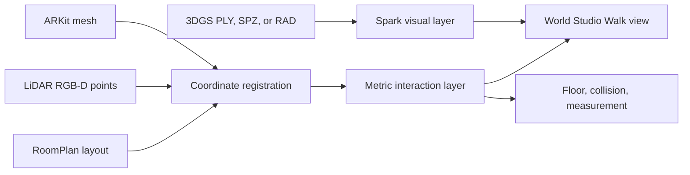

# 3DGS Walkthrough and Metric Measurement Plan

Last updated: 2026-08-21

## Objective

Make World Studio support an inside, first-person walkthrough of Gaussian splats
and ordinary point clouds on desktop and mobile. The Gaussian splat is the visual
layer. Registered LiDAR, ARKit mesh, RoomPlan, or metric point-cloud sidecars are
the basis for floors, collision, and measurements.

This distinction is mandatory: a visually plausible 3DGS is not automatically
metric, collision, semantic, or navigation authority.

## Architecture

```mermaid
flowchart LR
    A["3DGS PLY, SPZ, or RAD"] --> V["Spark visual layer"]
    B["ARKit mesh"] --> R["Coordinate registration"]
    C["LiDAR RGB-D points"] --> R
    D["RoomPlan layout"] --> R
    R --> M["Metric interaction layer"]
    V --> W["World Studio Walk view"]
    M --> W
    M --> X["Floor, collision, measurement"]
```

## Existing Foundation

World Studio already provides:

- Frame, Orbit, and Free cameras;
- source-frame camera alignment;
- pointer-lock mouse look;
- gravity leveling and a Center 360 preset;
- Spark 2.1 Gaussian rendering;
- Rapier physics;
- a two-click ground-plane measurement prototype.

Capture Splat already records:

- gravity-aligned ARKit camera poses and per-frame intrinsics;
- accepted RGB-D keyframes and a continuous-video frame index;
- metric LiDAR depth and confidence;
- a classified ARKit triangle mesh;
- RoomPlan USDZ and semantic proposals;
- capture-path length, loop status, overlap, and tracking evidence.

## Current Gaps

1. World Studio measurements currently intersect an artificial `y = 0` plane.
2. Spark splat raycasting is enabled but is not used for picking.
3. Rapier currently approximates OBJ groups with bounding boxes instead of using
   a walkable triangle mesh and a character controller.
4. Capture Splat metric sidecars are ingested, but the registered ARKit mesh is
   still review evidence rather than collision or measurement authority.
5. The current room handoff has an accepted ARKit-to-trainer transform chain;
   packages without accepted registration remain Fly-only.
6. Large Gaussian PLY files are loaded monolithically instead of using paged LoD.
7. Strict 3DGS job/asset/benchmark contracts now exist, but no production trainer is
   registered and no contract output is loaded into Spark or a canonical World automatically.

## Execution Phases

### Phase 1: Metric Handoff and Registration

Extend `capture-splat.world-studio.json` additively with:

- `assets.navigation_mesh`;
- `assets.mesh_report`;
- `assets.room_semantics`;
- `assets.camera_trajectory`;
- `assets.measurement_points`, when available;
- a strict metric-registration report.

The registration report must describe:

- `arkit_world -> colmap_world` camera-center Sim(3);
- `colmap_world -> trainer_world` trainer transform;
- the composed `arkit_world -> trainer_world` matrix;
- units and up axis;
- matched camera count;
- median and p95 residuals;
- residuals relative to scene radius;
- `accepted`, `held`, or `unavailable` status.

World Studio must ingest these references and state one of:

- `Walk eligible - registered metric mesh`;
- `Fly only - metric registration held`;
- `Fly only - metric geometry missing`.

RoomPlan data captured in a separate session remains an unregistered semantic
proposal until a separate RoomPlan-to-ARKit registration is validated.

### Phase 2: Walk and Fly Cameras

Expose four camera roles:

- **Frame**: exact selected source-camera evidence;
- **Orbit**: external asset inspection around a target;
- **Walk**: eye-height, gravity-constrained, collision-aware navigation;
- **Fly**: unrestricted first-person inspection.

Walk uses a Rapier kinematic capsule with:

- approximately 1.6 m eye height;
- delta-time movement, acceleration, damping, and speed limits;
- a locked horizon with roll disabled;
- slope limits, stair stepping, and snap-to-ground;
- collision against registered triangle geometry;
- explicit fallback to Fly when metric geometry is unavailable.

Desktop input uses pointer-lock mouse look and WASD/arrow movement. Mobile uses
a left movement control, right-side look drag, and optional tap-to-move. Input
must be continuous and frame-rate independent rather than one large jump per key.

### Phase 3: Surface-Backed Measurement

Move the ruler into Simulate, Walk, and Fly. Support:

- point-to-point distance;
- vertical height;
- polyline length;
- polygon area.

Picking priority is:

1. registered metric triangle mesh;
2. registered metric RGB-D point cloud;
3. Gaussian intersection as a labeled visual estimate.

Gaussian raycasting runs only on click or tap. It must not run every frame.
Measurements are written to `world_studio_measurements.json` with:

- points in the declared coordinate frame;
- units;
- measurement type and value;
- source asset path and checksum;
- registration status;
- basis and uncertainty;
- visual-estimate warning when no metric source was used.

### Phase 4: Large-Asset Loading

For Gaussian assets:

- retain the source PLY or SPZ as evidence;
- prebuild Spark quality LoD assets;
- use chunked `.rad` plus paged loading for large scenes;
- select a splat budget from measured device performance;
- report source splats, resident splats, visible splats, and frame time.

For ordinary point clouds:

- keep direct PLY loading for bounded fixtures;
- evaluate a Potree/COPC-style octree adapter for large assets;
- keep point-cloud and Gaussian delivery formats separate.

True progressive loading must not be claimed while the entire source PLY is
still read into browser memory.

### Phase 5: iPhone Walkthrough Capture Evidence

Build on the existing Room/Walkthrough intent. Add:

- a lightweight continuous ARKit camera trajectory;
- floor and walkable-path coverage;
- classified-mesh coverage;
- doorway crossings and return-path evidence;
- maximum path separation and loop completion;
- guidance for missing floor, doorway, side-parallax, and return coverage.

Recommended capture path:

1. Begin near eye height with a clear floor view.
2. Walk the perimeter slowly.
3. Cross the room diagonally in both directions.
4. Pass through each doorway in both directions.
5. Add side-facing passes along walls and furniture.
6. Add a short lower pass for floor and furniture contact edges.
7. Return to the starting area for loop closure.
8. Run RoomPlan after the appearance capture.

Avoid pure in-place rotation, fast turns, large exposure changes, and long
straight paths without side parallax.

## Current Benchmark Fixtures

The contract benchmark allowlist is exactly:

1. NeRF Synthetic Lego staged as private fixture `nerf-synthetic:lego`, with its derived
   known-pose adapter in the dedicated external test workspace.
2. Original-3DGS Deep Blending Playroom staged as private fixture
   `deep-blending:playroom` from its checksum-bound GraphDeco-INRIA archive.
3. Private Capture Splat fixture `capture-splat:2026-08-09T060230Z` with 122 accepted RGB-D
   frames.

Lego referenced-byte completeness and its deterministic known-pose adapter have been
revalidated. Lego and Playroom remain limited to private local technical evaluation and held
for redistribution, public demos, product use, and commercial use because dataset-byte rights
have not been cleared.
The local iPhone capture is the capture-to-training integration fixture.
All other OneDrive datasets, including Bonsai, DL3DV, and Lublin, stay cloud-only and outside
the active benchmark matrix. This contract slice does not hydrate or offload anything.

Current local evidence, scoped to these exact artifacts rather than upstream constants:

- the staged Lego manifest inventories 803 files with SHA-256
  `21454ce25a35b567d0701bff615914497df93af1ed80949763ae7c9b25189f3d`.
  The derived adapter dataset manifest hashes to
  `306531bb28d4ecebc5459c4b57afe164b5522d930bef7cd98e8be5d2b16ac41f`, and its adapter
  manifest hashes to `ae38a14ceed55b0070ee058fc55b7b1b40b402b9b2a0670ae874577dbe8d35bc`;
- the staged Playroom checksum list inventories 229 files and hashes to
  `bc23594180b9226dc5bacb4313e6036869d95c56d36d420666fea884f61f8eb6`;
  its local sparse metadata reports
  225/225 registered images, one `PINHOLE` camera, 37,005 points, and 0.616264 px mean
  reprojection error. Its first-class dataset manifest hashes to
  `494b7f8f069292f6b08497cbd8d820112c69677046ce39fd3c7e6268d4d8dc36`
  and binds the GraphDeco-INRIA-distributed T&T+DB archive SHA-256 plus exact 229/229 member
  parity;
- the local iPhone v0.3 probe uses capture profile `video_3dgs_max` and inventories 122
  frames with training-frame digest
  `sha256:9fa6cc5c8447be6a4f58a7d61b97bc15b584711454468a66fb65f1300c51875c`
  and handoff SHA-256
  `bb53d2c713fc9240d4750182e6c8b6032e75d2c3fbb51d90482bdd1b38f844c1`. Its independent
  300-frame HLOC reconstruction validation hashes to
  `1b9926601b7330a7c8b54572ec4509979cd88a143a44e9514047b12855ad9c7d`.

Lego completeness and the adapter hashes bind the measured known-pose route, but supplied
poses bypass feature matching, triangulation, and pose recovery and therefore do not validate
SfM or the iPhone capture-to-SfM lane. Neither Lego nor Playroom completeness clears dataset
rights or proves general reconstruction quality. The v0.3 iPhone values validate only that
local handoff's capture-evidence binding. The separate measured lane below binds SfM, trainer,
finite export, and Spark functional evidence, but it still does not promote reconstruction
quality.

The pinned Spirula Playroom run preserves the arbitrary COLMAP/SfM gauge. Its Gaussian asset
therefore records unknown length units and null up/forward axes and remains visual-only; no
measurement, collision, navigation, or physics use is allowed without separate accepted
metric registration. Spirula qlevel 1 uses mixed training storage (including quantized SH
and optimizer state), but checkpoint export dequantizes PLY properties to float32. The job
records mixed training-storage quantization while the exported PLY asset records no serialized
quantization; this is not evidence of compressed delivery.

### Measured Playroom Apple quality ladder and Spark gate - 2026-08-21

The first disk-cache evaluation ladder is rejected: Spirula's asynchronous disk decode path
repeated held-out views, leaving only five to seven unique cameras in an eight-camera set. The
superseding CPU-cache contract requires the same unordered eight-image GT hash set in every run.
All four corrected exploratory rungs and three corrected 7,000-step repetitions passed that
gate, produced eight unique renders, and had finite PLY payloads.

On the exact Apple M2 Max host, the corrected exploratory ladder measured:

| steps | splats | PSNR | SSIM | LPIPS Alex | process elapsed | max RSS |
| ---: | ---: | ---: | ---: | ---: | ---: | ---: |
| 500 | 36,593 | 21.6994 | 0.792177 | 0.469052 | 18.76 s | 1,008,893,952 B |
| 1,000 | 44,651 | 23.3253 | 0.820748 | 0.390421 | 33.79 s | 1,004,994,560 B |
| 3,000 | 99,912 | 26.3961 | 0.861971 | 0.289709 | 99.70 s | 1,005,518,848 B |
| 7,000 | 100,000 | 27.8425 | 0.883883 | 0.239737 | 237.74 s | 1,005,142,016 B |

Three warm 7,000-step repetitions measured median/p95 process elapsed time of
238.42/254.93 seconds and median/p95 maximum RSS of 1,009,696,768/1,012,547,584 bytes.
MPS LPIPS completed without CPU fallback. Because the trainer exposes no seed, only one scene
was measured, and only the selected rung was repeated, these are bounded host observations and
not a promoted World Studio quality claim.

The selected Spark asset is `playroom-fx-q7000-w3`: 100,000 splats, 24,801,531 bytes, zero
non-finite values, and PLY SHA-256
`12379d273214e5370e92c36f8e0cfe8761977ab5c10b1a83f9a371c5912a067b`. The checksum-bound
benchmark report is
`data/generated/world_studio_3dgs_quality_ladder_20260821/aede0ae3/evidence/playroom-quality-ladder-benchmark-report.v0.1.json`
with SHA-256 `a909eb2a9bc0cd2cd3d43287b0e9146e77765aa2084b75ee3b311ba76c256c45`.

The earlier 37,005-splat development probe identified off-centre framing and a passive wheel
listener warning. Robust bounded framing, non-periodic preview sampling, and the interaction
regression are now covered by unit, package-reader, and Playwright tests. The 100,000-splat
candidate subsequently passed Spark load, centered framing, orbit, and zoom with exact
provenance and manual screenshot review. The functional decision report hashes to
`59404b227647f48a544bb52ee7c93427d86b4e33e085b9b9ef61fc7994b41a60` as
`world-studio-spark-functional-decision.v0.1.json`. This promotes only candidate functional
visualization; first-visible latency, draw time, memory, image quality, metric measurement,
collision, navigation, and Newton physics remain held.

At current candidate implementation revision `cb0a93d`, the packaged preparation-path
regression returned the selected Playroom PLY byte-for-byte with `converted: false` and zero
scale clamps, rotation normalizations, or dropped outliers. Report
`playroom-prepare-spark-regression.v0.1.json` has SHA-256
`31b53e38ea97b5194562060a40d3ce651dadd5c846afb29e9204dbdc88f0181c`.
On 2026-08-22 a generic standard-dataset harness bound the complete `229`-file fixture,
dataset and per-file manifests, corrected trainer report, and exact selected PLY without
fabricating Capture Splat or Lego provenance. The packaged app reported Spark `2.1.0`, profile
`world-studio-default`, source `binary_little_endian`, preparation `native`, and 100,000 splats.
Initial visibility, orbit, inward zoom, clean diagnostics, source immutability, teardown, and
storage gates passed. Functional and manual-review report SHA-256 values are
`a6b03e825e9cec7849c1d4fe3f81d6558b6677119ec12dd7ea36f7b356d0410b` and
`bde803c8551151dcbe943dae0360841ff55e191289a03a94cfd875c4fd60e15a`.
Functional visualization is promoted; visible blur, smearing, and peripheral floaters keep
visual quality and candidate release held. A two-pair manual review bound to the all-eight
metrics confirms large-structure retention but material edge, texture, and thin-detail loss;
its SHA-256 is `ae6ba23a6aaa1be42c6a2e43d2bebdfcd034322b37c6cbeb3a16b64122d335c5`.

### Measured Lego known-pose ladder and Spark gate - 2026-08-21

The deterministic Lego adapter consumes the staged images and supplied camera transforms. Its
dataset manifest hashes to `306531bb28d4ecebc5459c4b57afe164b5522d930bef7cd98e8be5d2b16ac41f`,
and its adapter manifest hashes to
`ae38a14ceed55b0070ee058fc55b7b1b40b402b9b2a0670ae874577dbe8d35bc`. This is an
images-with-known-poses training gate: it bypasses SfM and does not validate feature extraction,
matching, triangulation, pose recovery, or the iPhone capture-to-SfM workflow.

On the exact Apple M2 Max host, the exploratory 7,000-step run measured 34.4092 PSNR,
0.975988 SSIM, and 0.0220346 LPIPS Alex. The selected third fresh repetition measured 34.4931
PSNR, 0.976296 SSIM, and 0.0217699 LPIPS Alex. Three fresh repetitions measured 147.67, 144.44,
and 153.32 seconds elapsed, with median/p95 147.67/152.755 seconds; maximum RSS was
819,625,984, 810,696,704, and 806,912,000 bytes, with median/p95
810,696,704/818,733,056 bytes. Outputs were written to external USB-attached APFS storage, so
these timing observations are non-production and cannot establish internal-storage throughput.

The selected repetition exported a finite 99,996-splat SH3 PLY of 24,800,538 bytes with
SHA-256 `8dd218d9b472845efb475f42423de95994333b708d7d3f80beb5f107273eeb78`. The
checksum-bound `spirula-lego-ladder-result.v0.2.json` hashes to
`a16f0d2371b3607e0376581c3cb047798e484c9a4b28c757464b5d898a7323d4`.

Candidate revision `cb0a93d71ec959bf4d1198499dc0fe2a122304ef` with Spark 2.1.0 loaded the
exact PLY and retained `spark gaussian · world-studio-default · 99996 splats` through initial
load, orbit, and inward zoom. R4 report `spark-lego-candidate-functional.v0.1.json` has SHA-256
`598b3d74c01f7bc9c2731bada9456aec026bc0ed5ae0540f79731d83470f06a3`. The bound initial,
orbit, and inward-zoom screenshots passed manual inspection in
`spark-lego-manual-visual-review.v0.1.json`, SHA-256
`7b4ab2019407fb1c6d2b073f4f14813750055953f726092985081084a5fe61c7`.

Renderer preparation clamped six scale values and hid two outlier rows only in the render-time
preview blob; the source PLY remained byte-identical. This gate promotes Spark 2.1 functional
visualization only. Candidate release remains held pending review and merge, and this evidence
does not establish image quality, Spark performance, metric scale, collision, navigation,
physics, Newton behavior, cross-vendor support, or general splat capacity.

### Measured iPhone HLOC-to-Spirula-to-Spark lane - 2026-08-21

The independent iPhone lane reconstructed 300 prepared frames with NetVLAD top-32 retrieval,
ALIKED-N16 features, LightGlue matching, and COLMAP. Checksum-bound report
`iphone060230-global-hloc-real-a077533f-r3.validation.json` has SHA-256
`1b9926601b7330a7c8b54572ec4509979cd88a143a44e9514047b12855ad9c7d`.
It promotes registration with 300/300 images registered, 14,888 points, 321,782 observations,
and 1.2636579 px mean reprojection error. Completed `capture_splat_sfm_summary.json` hashes to
`7b32d88ac49b1f8d9d01c02a7d22a43cafb3b81f78715f5084bd3a91f0131f5b`.
Overall package acceptance remains held because the raw SfM output is not self-contained, and
timing remains held because the run used external USB storage, a CPU override, a local worker
patch, one sample, and no thermal telemetry. Registration promotion is not a quality claim.

External report `spirula-iphone-ladder-result.v0.1.json` has SHA-256
`d64938544b19ca6314001547b3f0d20a418a2cd058da68f438b7fe9f427580d0`.
Its selected 7,000-step second repetition exported a finite 99,979-splat SH3 PLY of
24,796,322 bytes with SHA-256
`207edbe4020c9e7ba60fa836a2d66c7012d53a26eb99b7265d05075e6ac6759e` and measured
24.6459 PSNR, 0.868393 SSIM, and 0.209897 LPIPS Alex. Three fresh repetitions measured
median/p95 elapsed time of 540.33/552.75 seconds and median/p95 maximum RSS of
3,214,573,568/3,215,708,979.2 bytes. External-USB timing is non-production, and these bounded
metrics do not promote training or render quality.

Candidate revision `3ea4107` with Spark 2.1.0 retained
`spark gaussian · capture-splat-generic · 99979 splats` through load, orbit, and inward zoom.
R6 report `spark-candidate-functional.v0.1.json` has SHA-256
`ace2c7580129bfc6b59b434ee1f4396e72949cf2a130dcc2e391d8085654cbe9`. Its bound manual
review `spark-candidate-manual-visual-review.v0.1.json` has SHA-256
`7e55e53acb1396f031a2224bfa8437d5d4ad41765d115304bb8761b8d65a3ba1`.
Functional visibility, orbit, and zoom are promoted. Candidate release and render quality remain
held because the screenshots show blur, smearing, floaters, and poorly resolved surfaces.
Spark preparation clamped 11,452 scale values and hid nine outliers in the render-only preview;
the selected source PLY remained unchanged. The result remains a visual proposal with no
metric, collision, navigation, physics, Newton, performance, or general capacity authority.

This completes the first iPhone images-to-SfM-to-3DGS-to-Spark execution. The Lego known-pose
lane is a separate control and does not revalidate SfM. The next gate is capture and
reconstruction quality improvement with a checksum-bound same-camera before/after comparison,
not first pipeline execution.

### Room-01 native SfM, Spirula appearance, and portal/collider gate - 2026-08-23

The open-door Room-01 lane exercises the pinned Spirula native SfM candidate rather than the
older HLOC/COLMAP reconstruction path. It registered 411/450 inputs: 217/246 video frames and
194/204 authoritative RGB-D frames. ALIKED/LightGlue used Vulkan through MoltenVK, while the
accurate baseline used CPU double-precision bundle adjustment. This is a same-capture
product-candidate result, not an all-GPU or speed claim.
Accepted metric registration reports `0.455587656 m/unit`, with median/p95 residuals of
`0.029027/0.057314 m`, and produced a 92,906-point metric seed.

At 7,000 steps, external Spirula produced a finite 1,498,066-splat SH3 PLY of 371,521,900
bytes. The source asset remained unchanged and hashes to
`56dc6ab645f099bef670f07516046ce9ddcd65d94c44c007e08f35374bb37bd8`. Spark 2.1 passed
exact load, orbit, inward zoom, inside movement, reset, and teardown. Its functional report
hashes to `4e153b9c0b456a7b42a0256915ba218958a7faf20c09c269815d16d6078392c8`, and the bound
manual review hashes to `bec934101b91d9a5f6df09fedf6ca3cf2a913a6b30bb5cf5ec2f4bda28158e76`.
This promotes finite, inspectable, functional visualization only. Unrestricted-view quality,
named source-camera review, native-360 support, robot/drone RGB observations, performance,
and every metric or physics authority remain held. The approximately 90-degree orientation
error and missing output-index-to-source-camera binding are separate visual contract defects;
they are not collider evidence.

The trajectory records one `door_1` crossing, but accepted RGB-D portal membership is
`side_a/through/side_b = 0/0/204`. The TSDF contains 136,810 vertices and 260,038 faces.
The hybrid candidate leaves 59.1417% unknown; its 59,999-face reduction leaves 91.0382%
unknown and fails the connected-component and replayable-probe rails. It therefore cannot
support a floor, wall, doorway, free-space, collision, navigation, or physics claim.

Five reducer repetitions were byte-identical, with 7.94 s median elapsed time,
611,549,184-byte maximum RSS, and zero swaps. These samples demonstrate deterministic output
bytes for this fixture, but performance remains held because the run used one host and external
USB storage. The benchmark report hashes to
`5b5b415e151747acc2174b78861d7a4c855261507c084a953e30f1a43e2bb1d2`.

The Rapier consumer receipt hashes to
`0b8cf1b1fca7b0da50f66c7af8df4788a7a22771d05b4166abd065d4333959da`. Parser,
checksums, metadata, no-fallback behavior, unknown-region fail-closed behavior, and
controller-pose restore pass. Floor, wall, doorway, full episode reset, physical behavior,
and all collision/navigation/physics authority remain held. Controller-pose restore is not a
full reset claim.

Newton remains blocked. The next exact gate is a short supplemental reverse doorway RGB-D
pass covering side A, threshold, and side B, followed by a complete registered
portal/free-space route. Only a collider that then passes floor, wall, doorway, component,
and replayable-probe rails can enter the Rapier parity route and subsequent Newton/OpenUSD
work.

## Evidence Gates

- The floor is level and the horizon does not roll in Walk.
- Walk begins from a recorded, registered camera location inside the scene.
- The camera does not pass through registered walls or fall through floors.
- Every measurement reports its geometry source, coordinate frame, and units.
- Known-length checks are compared with LiDAR or RoomPlan references.
- Desktop and mobile frame time are reported separately.
- Each report binds exact dataset/job/asset hashes, hardware, command argv, build mode,
  cold runs, warmups, measured repetitions, raw samples, thermal/noise controls, fixed-camera
  PSNR/SSIM/MAE, and a `promote|hold|reject` decision.
- A known-pose fixture validates image ingestion, trainer consumption, finite export, and its
  declared evaluation route only; it never substitutes for an SfM or capture-to-SfM gate.
- A completed SfM-to-Spark execution and promoted registration do not promote reconstruction
  quality. Quality changes require checksum-bound before/after renders from the same cameras
  plus the declared image metrics and manual failure review.
- Spark functional promotion requires the exact input PLY hash and count, candidate revision,
  Spark version, unchanged post-render source bytes, interaction checks, and bound manual
  screenshots. It remains separate from quality, latency, draw-time, memory, and capacity.
- Timings from the external USB test volume are labeled non-production and are not compared
  with internal-storage or deployment targets as if the storage conditions were equivalent.
- Record the trainer seed only when the provider exposes and consumes it. The pinned Spirula
  CLI exposes no fixed-seed flag, so its jobs use `seed: null`; repeated stochastic outputs
  and differing hashes remain raw evidence rather than being labeled deterministic.
- Cross-vendor Vulkan, 10M SH3 in 8GB, native equirectangular, quantized-training, combined
  strategy, exposure/WB, built-in preprocessing, and derived-output claims remain held until
  their declared evidence conditions are measured. Quantized-training evidence binds the job's
  training-storage profile and never implies a quantized or compressed exported asset.
- Those capability holds are parallel claim-validation rails. They do not block Room-01's
  recovered self-contained package, complete metric mesh, collision candidate, canonical World,
  or Newton work when those artifacts pass their own gates.
- Large assets become interactive without loading the full source PLY first.
- Missing or held metric evidence produces `Fly only`, never a Walk claim.

## Progress Ledger

| Phase | Status | Evidence | Next gate |
| --- | --- | --- | --- |
| Research and repo audit | Complete | Video inspected; current World Studio and Capture Splat paths audited; Spark, Rapier, Potree, and Apple references reviewed | Preserve findings in code contracts |
| 3DGS job/asset/benchmark contracts | Implemented; two standard-scene ladders and candidate Spark functional gates passed; production runtime held | Playroom report `a909eb2a...c256c45`; current-candidate preparation regression `31b53e38...8f0181c`; Lego result `a16f0d23...a7323d4`; r4 Spark/manual evidence `598b3d74...70f06a3` / `7b4ab201...5fe61c7` | Review and merge the candidate; retain the standard scenes as controls for same-camera quality comparisons |
| iPhone HLOC to Spirula to Spark | First end-to-end functional execution complete; package, timing, release, and quality held | SfM validation `1b992660...d9c7d`; Spirula result `d6493854...580d0`; r6 Spark/manual evidence `ace2c758...4cbe9` / `7e55e53a...5a3ba1` | Improve capture and reconstruction quality, then run a checksum-bound same-camera before/after comparison |
| Room-01 native SfM to Spirula to Spark | Functional finite/inspectable candidate promoted; quality and authority held | Native SfM 411/450; 92,906-point registered seed; 1,498,066-splat PLY `56dc6ab...bd8`; Spark/manual reports `4e153b9c...c8` / `bec93410...76` | Fix orientation and native camera identity binding; continue collision work independently |
| 1. Capture Splat metric handoff | Complete for registration; portal route held | 194/204 RGB-D cameras registered at `0.455587656 m/unit`, median/p95 `0.029027/0.057314 m`; accepted portal membership is `0/0/204` | Capture a short reverse doorway RGB-D supplement spanning side A, threshold, and side B |
| 1. World Studio metric ingestion | Complete for registered evidence; collision authority held | The 136,810-vertex/260,038-face TSDF is registered; hybrid and reduced candidates retain 59.1417% and 91.0382% unknown coverage | Preserve the metric evidence, compile a complete registered portal/free-space route, then rerun collider rails |
| 2. Walk and Fly cameras | In progress; current Room-01 Walk held | Rapier parsing and fail-closed behavior pass, but floor, wall, doorway, full reset, physical behavior, and all authority remain held in receipt `0b8cf1b1...9da` | Pass component/probe and doorway/free-space rails before running the reference route; do not start Newton |
| 3. Surface measurement | Pending | Ground-plane ruler exists; Spark raycasting is enabled | Add metric raycast and annotation export |
| 4. Large-asset LoD | Pending | Spark 2.1 is installed; large local fixtures are available | Add RAD preparation and paged loading |
| 5. iPhone walkthrough evidence | In progress | Open-door capture has one `door_1` trajectory crossing, but its accepted RGB-D set does not bracket the portal | Capture the bounded reverse portal pass and preserve the current immutable capture as evidence |
| Final validation | Pending | Appearance is finite/inspectable; portal, collider, physics, and robot/drone observation gates remain held | Promote a complete collider and reference route before Newton/OpenUSD or robot/drone episodes |

## Progress Notes

### 2026-07-10 - Phase 1 Metric Contract

Capture Splat:

- Added optional public handoff inputs for navigation mesh, mesh report,
  RoomPlan semantics, continuous trajectory, and measurement points.
- Added automatic sidecar discovery from iPhone `capture.json`.
- Reused the RGB-D seed camera-center alignment to estimate the
  `arkit_world -> colmap_world` Sim(3).
- Composed the trainer transform and emitted target-units-per-meter and
  meters-per-target-unit.
- Added `eligible`, `held`, and `missing` Walk decisions while keeping top-level
  collision and navigation authority false.
- Validation: Python compileall passed; all 143 pytest tests passed; diff and
  public private-string checks passed.

World Studio:

- Added typed Capture Splat metric handoff fields.
- Added reader support for binary navigation mesh and measurement points plus
  mesh report, RoomPlan semantics, continuous trajectory, registration, and
  Walk eligibility.
- Added the metric interaction decision to package insights.
- Validation: all 52 Vitest tests passed; monorepo typecheck passed; diff check
  passed.

Remaining Phase 1 evidence gate:

- Export a package from a fresh physical iPhone capture and confirm that the
  real camera-center registration is accepted. Unit fixtures prove the contract
  and decision behavior, not physical alignment quality.

### 2026-07-11 - iPhone Stability Gate Before Fresh Capture

The walkthrough lane remains paused after Phase 1. Xcode reproduced an
Objective-C exception in the continuous-video recorder because its pixel-buffer
adaptor was created after the asset-writer input had started writing. Capture
Splat now creates the adaptor before `startWriting()`, owns the AR session
configuration explicitly, records AR session failures and interruptions, and
uses valid SF Symbols. The unsigned physical-device target builds successfully.

One physical Desk / Cluster pass then finalized without the previous exception:
6,179 continuous-video frames, 93 RGB-D keyframes, 132 person masks, and a
finite ARKit mesh were preserved. The host quality report returned `promote`,
and corrected full-resolution preparation produced a `ready` 300-frame
package with complete camera metadata. This is a useful Orbit/reconstruction
fixture, not the room-walkthrough registration proof.

The corrected build was subsequently installed and completed fresh Desk /
Cluster and Object Orbit Record -> Stop -> Finalize passes without a recorder
crash. Their continuous-video writers reported zero dropped frames and startup
latencies remained below 0.04 seconds. Both long passes reached a `serious`
thermal state, and Xcode retained-frame telemetry still needs to be checked
explicitly before treating recorder stability as fully closed.

The Desk and Object exports are useful reconstruction fixtures, but they do not
satisfy the physical room-registration gate. Before resuming Phase 2:

1. confirm the corrected build no longer emits the retained-`ARFrame` warning;
2. make a fresh Room Walkthrough capture;
3. export a World Studio handoff with trajectory and navigation mesh evidence;
4. validate real camera-center registration, scale, floor orientation, and
   metric mesh placement.

After those checks, resume here with navigation-mesh parsing and the
collision-aware Walk camera. Do not redo the completed Phase 1 handoff or
ingestion work.

### 2026-07-12 - Fresh Room Registration Evidence

The fresh Room Walkthrough export finalized without a recorder crash. It
contains 168 accepted RGB-D keyframes, 6,831 continuous-video frames with zero
writer drops, 40 person masks, and a finite classified ARKit mesh with 172,716
vertices and 300,000 triangles. Host capture QA returned `promote`, and
preparation produced a 300-frame package with complete per-frame camera and
mask evidence. The device reached a `serious` thermal state. RoomPlan semantics
were not exported, and room-specific overlap/loop guidance remained idle
because the scan target stayed in the shared Video 3DGS mode.

On an A100, pinned HLOC NetVLAD top-32 retrieval, ALIKED-N16, LightGlue, and the
integrated COLMAP global mapper registered 291 of 300 prepared images. One
continuous-video image, `000064.jpg`, had zero registered points and an extreme
camera center. The original model is preserved; a derived model deregistered
only that frame and retained 290 cameras and 24,387 sparse points. A separate
168-RGB-D-only global model registered every image but failed the physical
camera-center residual gate, so registration count alone did not promote it.

The filtered 290-camera model matched all 168 authoritative RGB-D cameras with
a median residual of 0.163 COLMAP units (2.81% of scene radius) and p95 residual
of 0.336 (5.77%). The metric seed contains 156,969 confidence-filtered points.
The exported World Studio handoff reports accepted metric registration and
eligible metric mesh evidence while retaining false collision, navigation,
semantic, and quality authority. This closes the physical Phase 1
camera-center registration gate. It does not yet prove correct floor
orientation, mesh placement, collision-safe Walk behavior, or trained 3DGS
quality.

### 2026-07-12 - A100 3DGS Review Proposal

The same filtered 290-camera metric package was trained at full resolution on
an A100 with gsplat and bilateral-grid post-processing. All three outputs are
finite. Strict raw source/render QA used the same 37 held-out cameras:

| Rung | Splats | Mean PSNR | Mean SSIM | Mean MAE | Weak frames | Decision |
| --- | ---: | ---: | ---: | ---: | ---: | --- |
| 3000 | 683,558 | 23.149 | 0.9429 | 0.04926 | 6 | Hold |
| 7000 | 1,226,209 | 23.510 | 0.9500 | 0.04963 | 5 | Hold; selected review proposal |
| 15000 | 1,612,183 | 23.781 | 0.9491 | 0.04906 | 5 | Hold; individual regressions |

The 15000 rung improved aggregate PSNR but regressed four individual cameras,
including large SSIM/correlation drops on prepared frames `000218` and
`000226`; its maximum splat radius also rose from 0.59 to 3.01. The controlled
ladder therefore stopped before 30000. This is a quality-gate decision, not a
claim that longer training can never help.

For interactive review, alpha pruning retained 601,786 finite 7000-rung
splats and dropped 50.9% near-transparent splats, below the 60% refusal gate.
The standalone handoff is
`room_walkthrough_world_studio_gsplat_7000_pruned_review`: 300 source frames,
168 matched metric cameras, accepted metric registration, eligible metric
mesh evidence, and 310 verified file checksums. The splat remains a visual
review proposal; collision, navigation, semantic, and quality authority are
all false. The next World Studio gate is visual floor orientation and mesh
placement, followed by collision-aware Walk.

### 2026-07-12 - World Studio Visual Acceptance

The selected 7000 review package initially failed to open because its ordinary
metric `points.ply` was binary little-endian. World Studio now converts binary
ordinary PLYs into capped ASCII previews while preserving the source file size
and checksum. Capture Splat metric points are mapped through the handoff
dataparser transform only when the manifest identifies them as COLMAP-world
measurement evidence.

Frame mode visually matches the selected source camera. Free, Inside, and 360
now use the accepted ARKit-to-trainer up vector instead of treating portrait
image-camera up as gravity, and generated first-person presets use the same
OpenCV camera convention as COLMAP. The doorway and wall edges remain level
during 360 rotation, and one-step W/arrow input remains controlled.

The classified ARKit navigation mesh is finite and present, but World Studio
does not yet render its binary PLY. Mesh placement therefore remains held, and
collision-aware Walk and metric measurement must not start until a separate
non-authoritative evidence-mesh path verifies overlap with the splat.

### 2026-07-13 - Registered Evidence Mesh Acceptance

World Studio now parses ASCII and binary little-endian classified PLY meshes,
applies the accepted ARKit-to-reconstruction transform, and samples at most
60,000 source faces for review. Packages without accepted registration do not
render the mesh and receive an explicit warning.

Simulate exposes `Splat`, `Splat + Mesh`, and `Mesh` states. Controlled Electron
captures of frame `000001` show the sampled floor, wall, window-side, and
furniture geometry overlapping the selected 7000 splat. The source mesh has
300,000 faces; the review layer sampled 60,000. Rapier stayed at two existing
colliders in every state, proving that the evidence mesh did not silently enter
physics.

This closes mesh-placement review for the current room handoff only. The raw
mesh remains non-authoritative evidence. The next Phase 2 gate is a separately
derived, simplified collision candidate with floor continuity, wall retention,
triangle-budget, and character-controller tests before enabling Walk.

### 2026-07-13 - Collision Candidate Gate

World Studio now validates every PLY vertex and face before preview sampling.
The local collision-candidate path checks source report counts, finiteness,
classification support, degenerate triangles, floor and wall connectivity, and
a 60,000-triangle budget. It does not hand-roll browser-side decimation: a
larger complete mesh is held for an offline, topology-preserving simplifier.
An accepted candidate remains labeled `local collision preview`, not metric,
navigation, or collision authority.

The accepted path uses a separate Rapier kinematic capsule, triangle-mesh
collider, slope limits, autostep, and snap-to-ground. It never uses the Pilot
OBJ bounding boxes and never creates an artificial fallback floor. Simulate now
labels unrestricted first-person inspection as `Fly`; `Walk` is enabled only
for an accepted local candidate.

The current 7000 room package is correctly held. Its source report declares
172,716 vertices and 300,000 triangles with `truncated: true`; the iPhone export
stopped at its triangle cap without proving coverage preservation. Deterministic
Electron verification showed `Walk` disabled with `source mesh truncated`,
while `Fly`, Frame, Orbit, and evidence-mesh review remained available. The
next gate is a complete or coverage-preserving iPhone mesh export plus a new
checksum-bound candidate report. Metric measurement remains blocked.

## Reference Boundaries

- Spark remains World Studio's Gaussian renderer.
- Spark stays pinned at 2.1.0 for this contract checkpoint; the contract does not change its
  loader or claim SPZ/RAD/LoD support.
- Spirula Studio is a GPL-3.0 external-process/reference boundary pinned at
  `aede0ae3b2d01a7930c71b9c7f52354dc180146b`; no implementation code is copied into World
  Studio.
- Rapier remains the current browser physics implementation for this plan checkpoint. The
  public roadmap targets capability-routed supervised workers and removes Rapier only after
  parity and cutover gates pass.
- Potree is an evaluation reference for ordinary large point clouds.
- AHOLO patterns inform navigation and LoD UX but are not a runtime dependency.
- Source frames remain visual evidence.
- Trained splats remain review proposals unless separate metric evidence is
  registered and validated.
