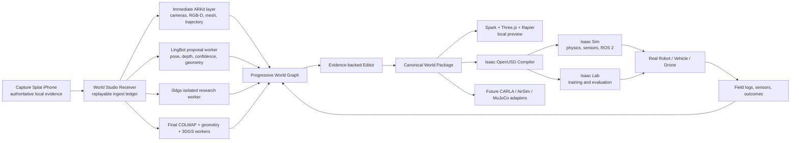

# World Studio should be the compiler between reality and simulation

> Curated from the supplied proposal on 29 July 2026. Repository-relative links replace
> temporary attachment links, and the public product name is normalized to Capture Splat.
> The unchanged extracted bundle is preserved under [`source/`](source/).
> Current adoption status, active contract paths, and runtime capability decisions are
> authoritative in this folder's `README.md` and `ADOPTION_STATUS.md`; version pins and
> implementation claims below remain source-brief planning context.
> The permanent Rapier assumption below is superseded by the
> [R2S2R and Newton adoption note](r2s2r-newton-2026-07-29/README.md). Rapier remains the
> migration baseline until the documented Newton parity and cutover gates pass.

I prepared a Codex-ready implementation bundle containing the product strategy, system architecture, NVIDIA Isaac integration design, R2S2R validation framework, implementation roadmap, JSON Schemas, examples, and a direct Codex prompt:

[Browse the preserved blueprint source](source/)

[Read the blueprint overview](source/README.md)
[Read the NVIDIA Isaac integration design](source/docs/03_isaac_integration.md)
[Read the historical Codex implementation prompt](source/CODEX_PROMPT.md)

The three supplied JSON Schemas and their examples were syntactically checked by the
bundle author. That report is provenance, not current runtime adoption evidence.
[View the preserved validation report](source/VALIDATION_REPORT.txt).

---

## 1. The central product decision

Do not build World Studio as:

* another Gaussian-splat editor;
* another general-purpose robotics simulator;
* a replacement for Isaac Sim;
* a black-box “video in, perfect simulation out” system;
* a system where the visually best representation automatically becomes the physics representation.

Build it as an **evidence-backed world compiler and operating layer for real-to-sim-to-real robotics**.

The ownership boundaries should be:

```text
Capture Splat
    owns authoritative capture evidence

World Studio
    owns the progressive world
    owns units and coordinate frames
    owns provenance and uncertainty
    owns edit/version history
    owns object and semantic graphs
    owns robot profiles and tasks
    owns simulation readiness
    owns episodes and real-world reconciliation

Spark + Three.js + Rapier
    provide immediate visual/editor/local-preview execution

NVIDIA Isaac Sim
    provides high-fidelity physics, sensors, robot integration and ROS 2

NVIDIA Isaac Lab
    provides parallel training and evaluation

Real robots
    return evidence that improves the next world version
```

A useful positioning sentence is:

> **Capture a place once. World Studio turns the evidence into a versioned, editable, simulation-ready world, compiles it into the robotics runtime you use, and improves it whenever real deployments return new evidence.**

This follows the important distinction World Labs makes between a renderer and a simulator: a renderer outputs plausible observations, whereas a simulator must expose geometrically and physically meaningful state that robots and programs can act on. ([World Labs][1])

---

# 2. How World Studio remains differentiated

## 2.1 Do not compete with capture applications on scanning alone

The Capture Splat advantage is not simply that it can produce a beautiful 3D reconstruction. Its defensible advantage should be the **capture evidence chain**:

* accepted frames are written durably on the phone first;
* networking cannot change capture acceptance;
* every frame has a stable identity, sequence ID, byte length and SHA-256;
* upload can resume after interruption;
* RGB, pose, intrinsics, depth, confidence, masks and quality measurements remain associated;
* reconstruction can be rerun later using better models;
* simulator products can always be traced back to physical evidence.

Most capture products finish when the model is generated. World Studio begins there.

## 2.2 Do not compete with SuperSplat or Spark as an editor alone

SuperSplat and related tools are useful for visual optimization and editing. Spark is valuable because splats, meshes, cameras, semantic overlays and controls can coexist in the Three.js scene graph. But Three.js and Spark should remain the visual/editor composition layer, while an external physics engine handles contacts and dynamics. Your previous architecture correctly separated browser visual composition from authoritative simulation physics.

World Studio’s scene is different because it contains several linked authorities:

| Authority        | Representation                                                 |
| ---------------- | -------------------------------------------------------------- |
| Capture evidence | Original RGB, depth, confidence, poses, calibration            |
| Appearance       | PLY, SPZ, SOG, optional textured mesh                          |
| Metric structure | RGB-D fusion, TSDF, Poisson or validated geometry              |
| Collision        | Simplified mesh, primitives, convex objects, heightfields      |
| Navigation       | Occupancy, floor surface, free space, no-go zones              |
| Semantics        | Object graph, labels, relationships, evidence views            |
| Interaction      | Affordances, joints, grasp/contact regions                     |
| Physics          | Mass, friction, restitution, stiffness, uncertainty            |
| Task             | Spawn, goals, success, failure and evaluator                   |
| Episode          | Exact world version, policy, actions, observations and outcome |

The existing dual-artifact design—metric mesh for collision/navigation and SPZ/3DGS for appearance—is the right foundation.

## 2.3 Do not compete with Isaac Sim as the simulator

Isaac Sim already supplies many of the components that would be expensive and strategically distracting to rebuild:

* robotics-oriented physics and collision;
* robot and articulated-asset ingestion;
* camera, depth, LiDAR, radar, IMU, contact and raycast sensors;
* ROS 2 bridges;
* synthetic data generation and randomization;
* robot controllers, Nav2 and manipulation workflows;
* debugging and simulation inspection;
* GPU execution and headless deployment.

NVIDIA’s own reference architecture treats Isaac Sim as one component in a larger solution, with geometry authoring, importing, scene setup, interaction and use-case execution happening as distinct task groups. This is exactly where World Studio should enter: **before Isaac, as the environment-authoring and world-compilation system**. ([Isaac Sim Documentation][2])

## 2.4 Differentiate carefully from Dirac Robotics

The broader Dirac launch statement you shared describes a video-and-task-to-simulation vision. Its current public site, however, prominently emphasizes **physics-accurate simulation assets**, physical values generated by its Real2Sim pipeline, validation against real objects, and stated confidence for parameters such as mass, friction and stiffness. ([Dirac Robotics][3])

World Studio should not initially compete by claiming better automatic material or object-physics inference. Its stronger initial differentiation is:

* entire captured environments rather than individual assets;
* live progressive capture-to-world workflow;
* local-first/private evidence;
* editable, versioned worlds;
* separate visual, structural, collision and semantic authorities;
* task- and embodiment-specific compilation;
* multi-simulator output;
* incremental recapture when a real site changes;
* real deployment episodes connected to the exact world version.

Later, World Studio could incorporate a Dirac-like physical-asset calibration workflow as one subsystem.

## 2.5 Differentiate responsibly from World Labs

World Labs describes R2S2R as transforming robots, sensors, environments, objects and interactions into aligned simulation, then using that simulation for training and for predicting real-world policy performance. It also emphasizes generating thousands of controlled variations from one physical task. ([World Labs][4])

World Studio should not immediately claim equivalent general manipulation or zero-real-data transfer. Its differentiation can be:

* developer-owned and local-first evidence;
* explainable authority and uncertainty;
* open, documented world contracts;
* human-editable and non-destructive history;
* simulator independence;
* compatibility with existing ROS and robot stacks;
* progressive operation before final reconstruction;
* modular use of open and commercial reconstruction workers;
* practical indoor navigation first;
* incremental field updates instead of rebuilding a simulation.

The supplied World Labs source is particularly important because it identifies the actual value of R2S2R: not merely visual similarity, but matched observations, object motion, outcomes, failure regions and policy rankings.

---

# 3. The architecture World Studio should use

## 3.1 Extended end-to-end architecture



## 3.2 Use an immutable evidence plus derived-version graph

Never rewrite an earlier reconstruction or capture.

```text
Capture evidence v1
    -> LingBot proposal
    -> TSDF geometry proposal
    -> final COLMAP reconstruction
    -> final Gaussian reconstruction
    -> user edits
    -> promoted collision v1
    -> Isaac export v1
    -> simulated episodes
    -> real episode
    -> calibration proposal
    -> World v2
```

World v2 should point to World v1 and record only the changes and stronger assertions.

## 3.3 Introduce a canonical World Package

I recommend a backend-neutral package such as:

```text
room_001.wsworld/
├── manifest.json
├── evidence/
├── transforms/
├── reconstruction/
│   ├── visual/
│   ├── geometry/
│   ├── collision/
│   └── navigation/
├── semantics/
├── physics/
├── robots/
├── tasks/
├── variants/
├── adapters/
│   ├── isaac/
│   └── rapier/
├── episodes/
├── validation/
└── history/
```

The manifest must record:

* world ID and immutable version;
* parent version;
* canonical metric units;
* handedness and axes;
* gravity;
* capture-session manifests;
* complete frame/transform graph;
* artifact role and hash;
* worker, model, commit and input provenance;
* promotion status;
* approved and prohibited uses;
* readiness level;
* warnings.

The bundle contains a proposed `world_studio.world.v0.1` JSON Schema and working example.

## 3.4 Make authority explicit

A model output should begin as a **proposal**.

It becomes **validated** after automated or physical testing.

It becomes **promoted** only when World Studio is allowed to use it for a declared task.

For example:

```json
{
  "domain": "collision",
  "artifact_id": "collision_mesh_003",
  "status": "promoted",
  "approved_for": ["indoor_mobile_navigation"],
  "not_approved_for": ["precision_manipulation"],
  "confidence": 0.86
}
```

This is how World Studio can be honest and useful even while parts of real-to-sim remain uncertain.

## 3.5 Add Simulation Readiness Levels

The UI should not show one generic “simulation ready” badge.

| Level | Meaning                                        |
| ----- | ---------------------------------------------- |
| R0    | Reconciled, reprocessable evidence             |
| R1    | Visually inspectable scene                     |
| R2    | Metric geometry validated within stated limits |
| R3    | Static navigation-ready collision/free space   |
| R4    | Target sensor stack aligned                    |
| R5    | Selected rigid interactive objects validated   |
| R6    | Articulated objects validated                  |
| R7    | Deformable/contact-rich task validated         |
| R8    | Simulation predicts real deployment decisions  |

Your initial product target should be **R3–R4 for indoor mobile robots and vacuums**.

Manipulation, articulation and deformables should come later.

---

# 4. Why NVIDIA Isaac integration has to be done

## 4.1 It proves World Studio is more than a viewer

Without an external robotics simulator, World Studio can show:

* captured rooms;
* splats;
* geometry;
* annotations;
* simple collisions;
* paths.

With Isaac, it can also show:

* the robot’s actual collision body;
* sensor outputs from the robot’s configured locations;
* ROS 2 commands and transforms;
* wheel, joint or flight dynamics;
* contact and collision events;
* synthetic data;
* repeated seeded episodes;
* policy training and evaluation;
* real-versus-sim comparison.

That is the point at which the product becomes part of a robotics engineering workflow.

## 4.2 NVIDIA has already validated your dual-representation approach

NVIDIA’s official World Labs Marble-to-Isaac workflow exports:

* a Gaussian PLY for visual appearance;
* a GLB collider mesh for physics;
* conversion of the PLY into a NuRec USDZ visual volume;
* alignment of the collider with the Gaussian volume;
* physics enabled on the collider, not the Gaussians. ([NVIDIA Developer][5])

World Studio should automate this process.

```text
Capture Splat evidence
    ├── Gaussian PLY/SPZ/SOG
    │       -> optional NuRec USDZ
    │       -> visual layer
    │
    └── validated collision GLB/USD
            -> collision and physics layer
```

Do not throw away the canonical PLY/SPZ after conversion. NuRec utilities are currently documented as experimental, with no guarantee of future-compatible APIs, formats or outputs. Keep NuRec version-pinned and optional. ([Isaac Sim Documentation][6])

---

# 5. How the Isaac integration should work

## 5.1 Use an external NVIDIA worker

As of July 29, 2026, Isaac Sim 6.0.1 is the latest public release, dated June 2026. Full Isaac Sim is available for Linux and Windows; macOS receives the WebRTC streaming client. ([Isaac Sim Documentation][7])

Therefore:

```text
MacBook
    World Studio Electron
    Spark/Three.js/Rapier
    MLX semantic workers
    receiver and orchestration

Linux RTX workstation or cloud GPU
    reconstruction workers
    Isaac Sim
    Isaac Lab
    OpenUSD compiler
    NuRec conversion
    ROS 2 bridge

MacBook
    receives WebRTC Isaac stream
    displays jobs, results and validation
```

NVIDIA explicitly supports a headless full streaming mode on an RTX workstation that can be accessed from the macOS WebRTC client or a web viewer. ([Isaac Sim Documentation][8])

The current Isaac Sim requirements specify workstation-class RTX hardware, with 16 GB VRAM at the stated minimum, and say the container is supported only on Linux. The current aarch64 build is supported only on DGX Spark. ([Isaac Sim Documentation][9])

Your Jetson Orin Nano should therefore be treated primarily as:

* robot-side inference hardware;
* edge sensor processing;
* deployed ROS nodes;
* policy execution;
* a source of real-world episode evidence.

It should not be planned as the main Isaac Sim training machine.

## 5.2 Compile into layered OpenUSD

Do not produce one flattened USD file. Generate layers:

```text
world.usda
├── 00_frame.usda
├── 10_visual.usda
├── 20_collision.usda
├── 30_semantics.usda
├── 40_physics.usda
├── 50_navigation.usda
├── 60_robots.usda
├── 70_task.usda
├── 80_randomization.usda
└── 90_session.usda
```

This separation allows World Studio to:

* replace a collider without retraining the splat;
* change the robot without rebuilding the environment;
* switch task definitions;
* apply stronger run-specific overrides;
* compare physics alternatives;
* select layout or appearance variants;
* unload large visual payloads for headless training.

OpenUSD composition supports sublayers, references, payloads, variants and sparse non-destructive overrides, making it an appropriate simulator projection of the canonical World Package. ([OpenUSD][10])

World Studio remains authoritative; USD is an Isaac adapter product.

## 5.3 Build a thin Isaac extension

Suggested extension:

```text
capturessplat.world_studio
├── importer
├── validator
├── collision_builder
├── semantic_builder
├── ros2_builder
├── task_builder
├── episode_recorder
└── result_reporter
```

It should:

1. read the World Package manifest;
2. validate hashes, paths, units and transforms;
3. build or open the layered USD stage;
4. load visual and collider assets;
5. apply semantic and physics schemas;
6. attach a robot profile;
7. create sensors;
8. create ROS 2 graphs;
9. build task success and failure evaluators;
10. run preflight tests;
11. record every episode;
12. return structured results to the Mac.

Keep general world logic outside the extension so future adapters can use it.

## 5.4 Separate the job API from ROS 2

Use HTTP/gRPC/WebSocket job control for:

* compiling a world;
* uploading or referencing artifacts;
* starting batches;
* retrieving results;
* cancelling work;
* reporting capabilities;
* WebRTC connection details.

Use ROS 2 only for robot-facing behavior:

* `/clock`;
* TF and odometry;
* camera/depth/LiDAR/IMU;
* `cmd_vel`, Ackermann or joint control;
* Nav2;
* MoveIt-style workflows;
* real/sim interface parity;
* rosbag2 episode recording.

Isaac currently recommends ROS 2 Humble and Jazzy. I would make Jazzy the default for new Ubuntu 24.04 workers while retaining a Humble compatibility configuration. ([Isaac Sim Documentation][11])

## 5.5 Add Isaac Lab after the static Isaac adapter works

Isaac Lab supplies GPU-accelerated, modular robot-policy training and evaluation across RL and imitation-learning workflows. ([NVIDIA Developer][12])

The current `release/3.0.0-beta2` branch is mapped to Isaac Sim 6.0.0/6.0.1, so pin that pair behind an experimental adapter rather than tracking unbounded latest versions. ([GitHub][13])

Map World Studio concepts as follows:

| World Studio      | Isaac Lab                                         |
| ----------------- | ------------------------------------------------- |
| World Package     | Scene/environment assets                          |
| Robot profile     | Articulation, actuators and sensors               |
| Task profile      | Observations, actions, rewards and termination    |
| Variants          | Domain-randomization events                       |
| Episode contract  | Reset, seed and initial conditions                |
| Evaluation matrix | Parallel environments, policies and checkpoints   |
| Field residuals   | Updated uncertainty, curriculum and distributions |

The first Isaac Lab use should be **batch evaluation**, not an ambitious claim that World Studio automatically trains a universal policy.

---

# 6. How to close the real-to-sim-to-real loop

World Labs’ strongest evaluation principle is that a useful simulator should support the same decisions as reality: identify success and failure, rank policies and predict whether improvements will transfer. ([World Labs][4])

World Studio should validate in this order:

```text
Evidence integrity
    -> metric scale and coordinates
    -> visual alignment
    -> geometry and collision
    -> sensor alignment
    -> matched open-loop dynamics
    -> closed-loop robot behavior
    -> policy ranking and failure-region prediction
```

## Real episode ingestion

Every physical deployment should return:

```text
real_episode/
├── world_version.json
├── robot_profile.json
├── task.json
├── policy.json
├── commands/
├── tf_odometry/
├── sensors/
├── events/
├── outcome.json
├── operator_notes.json
└── checksums.sha256
```

World Studio then:

1. aligns clocks and frames;
2. replays the actions in the corresponding simulated world;
3. computes observation, trajectory, collision and outcome residuals;
4. classifies likely causes;
5. proposes geometry, sensor or physics corrections;
6. promotes approved corrections into World v2;
7. reruns the complete regression matrix.

This turns a deployed robot into a continuous world-calibration instrument.

---

# 7. Recommended implementation order

| Phase | Build                                                                           | Promotion gate                                             |
| ----- | ------------------------------------------------------------------------------- | ---------------------------------------------------------- |
| 0     | Freeze schemas, versions, transforms and licenses                               | Fixtures validate and upstream workers reproduce           |
| 1     | Replay-first receiver with fault injection                                      | Disconnects, duplicates and corruption reconcile correctly |
| 2     | Progressive cameras, trajectory, RGB-D, mesh and LingBot proposals              | Proposals never overwrite authority                        |
| 3     | Canonical package, edit/version graph, collision proposals and local simulation | Reversible edits and aligned visual/collision layers       |
| 4     | Isaac Sim 6.0.1 static indoor adapter                                           | One job produces a working USD world and mobile robot      |
| 5     | ROS 2 and sensor parity                                                         | Same robot interface operates in simulation and hardware   |
| 6     | Isaac Lab evaluation and controlled variants                                    | Seeded rollouts are reproducible                           |
| 7     | Real episode ingestion and calibration                                          | Physical run creates traceable World v2                    |
| 8     | Expand to UAVs, cars and manipulation                                           | Separate readiness gates for each domain                   |

Do not let i3dgs, NOVA3R, semantic VLMs or other research workers become release blockers. NOVA3R should remain an amodal geometry prior rather than a direct collider source.  MLX-VLM should remain the semantic grounding, annotation and QA layer, not the geometry pipeline.

---

# 8. The first end-to-end product demonstration

The best first demonstration is a robot vacuum or small mobile robot in one captured room:

1. Capture the room with the iPhone.
2. Briefly disconnect Wi-Fi to demonstrate recording independence.
3. Show the Mac receiving and reconciling keyframes.
4. Display trajectory, RGB-D points, mesh and progressive Gaussian reconstruction.
5. Show visual, metric, collider and uncertainty layers independently.
6. Draw two cleaning zones and one fragile-floor no-go zone.
7. Select a robot profile and charging-dock pose.
8. Compile the world into Isaac.
9. Stream Isaac back to the Mac.
10. Run the robot through ROS 2/Nav2.
11. Vary clutter, lighting, sensor noise, floor friction and initial pose.
12. Run the corresponding task on the physical robot.
13. Import the real episode.
14. Show the differences and produce World v2.

The demo proves:

* local-first reliable capture;
* progressive reconstruction;
* non-destructive editing;
* representation authority;
* Isaac compilation;
* ROS compatibility;
* simulation variation;
* real-world reconciliation.

That is substantially more defensible than a demo where a splat merely looks realistic.

---

# 9. Important commercial constraint

NVIDIA’s current license FAQ says internal commercial R&D is free, selling simulation outputs does not require NVIDIA AI Enterprise, and selling custom Python code or USD assets for customers to run in their own Isaac environment does not require it. Redistributing Isaac Sim/Omniverse Kit or delivering it as a turnkey third-party service does require NVIDIA AI Enterprise. ([Isaac Sim Documentation][14])

The initial commercial delivery model should therefore be:

```text
World Studio application
+ canonical World Package
+ exported USD assets
+ adapter code
+ validation reports

Customer runs Isaac in its own environment
```

A hosted managed-Isaac product can be evaluated separately with appropriate NVIDIA licensing. This is an engineering interpretation, not legal advice.

---

## Deliverables included in the bundle

The package contains:

* a 91 KB research and implementation blueprint;
* five detailed architecture documents;
* a direct Codex prompt;
* current source register;
* `world_studio.world.v0.1` JSON Schema;
* `capture_splat.live_session.v0.1` JSON Schema;
* `isaac_job.v0.1` JSON Schema;
* example world manifest;
* mobile robot profile;
* indoor navigation task;
* Isaac batch job;
* schema-validation report.

[Browse the preserved extracted source](source/)

[1]: https://www.worldlabs.ai/blog/taxonomy-of-world-models "https://www.worldlabs.ai/blog/taxonomy-of-world-models"
[2]: https://docs.isaacsim.omniverse.nvidia.com/6.0.1/introduction/reference_architecture.html "https://docs.isaacsim.omniverse.nvidia.com/6.0.1/introduction/reference_architecture.html"
[3]: https://www.diracrobotics.com/ "https://www.diracrobotics.com/"
[4]: https://www.worldlabs.ai/blog/real-to-sim-to-real "https://www.worldlabs.ai/blog/real-to-sim-to-real"
[5]: https://developer.nvidia.com/blog/simulate-robotic-environments-faster-with-nvidia-isaac-sim-and-world-labs-marble/ "https://developer.nvidia.com/blog/simulate-robotic-environments-faster-with-nvidia-isaac-sim-and-world-labs-marble/"
[6]: https://docs.isaacsim.omniverse.nvidia.com/6.0.1/assets/nurec_utils.html "https://docs.isaacsim.omniverse.nvidia.com/6.0.1/assets/nurec_utils.html"
[7]: https://docs.isaacsim.omniverse.nvidia.com/6.0.1/installation/download.html "https://docs.isaacsim.omniverse.nvidia.com/6.0.1/installation/download.html"
[8]: https://docs.isaacsim.omniverse.nvidia.com/6.0.1/installation/install_faq.html "https://docs.isaacsim.omniverse.nvidia.com/6.0.1/installation/install_faq.html"
[9]: https://docs.isaacsim.omniverse.nvidia.com/6.0.1/installation/requirements.html "https://docs.isaacsim.omniverse.nvidia.com/6.0.1/installation/requirements.html"
[10]: https://openusd.org/release/glossary.html "https://openusd.org/release/glossary.html"
[11]: https://docs.isaacsim.omniverse.nvidia.com/6.0.0/ros2_tutorials/ros2_landing_page.html "https://docs.isaacsim.omniverse.nvidia.com/6.0.0/ros2_tutorials/ros2_landing_page.html"
[12]: https://developer.nvidia.com/isaac/lab "https://developer.nvidia.com/isaac/lab"
[13]: https://github.com/isaac-sim/IsaacLab "https://github.com/isaac-sim/IsaacLab"
[14]: https://docs.isaacsim.omniverse.nvidia.com/6.0.1/common/license-faq.html "https://docs.isaacsim.omniverse.nvidia.com/6.0.1/common/license-faq.html"
