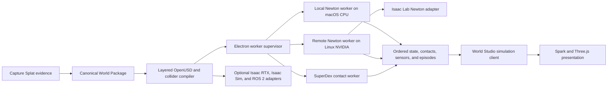

# Newton Runtime Architecture

## Decision

Newton is the default World Studio OpenUSD/general physics runtime. SuperDex is a separate
contact-rich specialist; neither engine is a browser dependency. This document specifies the
Newton side of the shared capability-routed boundary.

## Ownership

| Component | Owns |
|---|---|
| Capture Splat | Immutable source evidence, metric priors, calibration-trial recordings, and deployment recaptures |
| World Studio | World and asset versions, task/eval/deployment records, authority, and promotion |
| Newton worker | Dynamics, contacts, joints, physical state, physics sensors, and deterministic stepping |
| SuperDex worker | Contact-rich dynamics, dense force distributions, tactile/contact observations, and supported deformables |
| Spark and Three.js | Visual/Gaussian rendering, editing, overlays, picking, and interpolated display |
| Isaac Lab Newton | Parallel policy training and batch evaluation |
| Isaac/ROS adapters | Separately validated rendering, sensors, robot interfaces, and conformance |

Rendered transforms never feed back into Newton as authoritative state. Gaussian
appearance never becomes collision geometry.

## Worker Boundary

Electron supervises the worker because it already owns trusted filesystem and local-service
IPC. The web renderer receives a solver-neutral `SimulationClient` API.

Every worker session reports:

- backend, adapter, Python, OS, driver, device, and all backend dependency versions;
- solver-profile ID and immutable configuration hash;
- source World, Asset, Robot, Sensor, and Task hashes;
- coordinate frame, units, gravity, timestep, substeps, seed, and determinism mode;
- supported solvers, contacts, shapes, sensors, rendering, and batch size;
- start, ready, stepping, paused, failed, and finalized lifecycle state;
- bounded logs, timing, memory, dropped-state, and failure evidence.

The worker accepts only safe relative artifact paths rooted in a job directory. It may not
mutate the canonical World Package.

## Initial Solver Profiles

### `newton-mujoco-rigid-v1`

First parity profile for rigid and articulated mobile robots:

- Newton 1.5.0 baseline;
- `SolverMuJoCo`;
- `use_mujoco_cpu=true` on macOS;
- MuJoCo Warp on supported Linux/NVIDIA workers;
- fixed timestep and substeps;
- deterministic mode where supported;
- primitive, heightfield, or validated convex/decomposed collision preferred;
- explicit contact-pipeline field in every job and Episode.

### `newton-mujoco-newton-contacts-v1`

Gated profile for task-relevant non-convex, SDF, or hydroelastic contacts:

- `SolverMuJoCo(use_mujoco_contacts=false)`;
- Newton `CollisionPipeline`;
- CUDA when required by the selected SDF or hydroelastic path;
- effective collider compared with metric source geometry;
- no promotion from successful import alone.

### Research Profiles

Kamino, VBD, XPBD, MPM, coupled solvers, deformables, and differentiable workflows remain
named experiments. Their parameters and claims are not interchangeable with the rigid
MuJoCo profile.

## Collision Gate

Default MuJoCo mesh contacts convex-hull non-convex meshes. A captured room may therefore
lose doorways, create false walls, or close free space.

Before collision or navigation promotion, World Studio must:

1. choose primitives, heightfields, convex decomposition, or a validated Newton
   non-convex/SDF path;
2. preserve the original metric mesh as evidence;
3. compare effective collider distance, openings, floor continuity, wall retention, and
   route clearance against metric evidence;
4. run task probes for spawn, route, contact, and no-go behavior;
5. record `promote|hold|reject` with approved and prohibited uses.

## Platform Policy

**Apple Silicon Mac**

- bounded CPU previews;
- static indoor validation;
- small rigid/articulated Episodes;
- editor interaction and deterministic fixture replay;
- no claim of GPU-speed Newton.

**Linux or Windows with NVIDIA GPU**

- MuJoCo Warp;
- parallel evals and training;
- CUDA graph workflows where supported;
- high-volume sensors;
- gated SDF/hydroelastic, deformable, and multiphysics experiments.

**Browser only**

- visual/editor client only;
- physics controls report `worker unavailable`;
- no hidden JavaScript physics fallback after cutover.

## Authority

Newton execution is physics evidence for one declared profile. Physical authority still
requires measured parameters, uncertainty, held-out real/sim trials, and a declared task
envelope.
