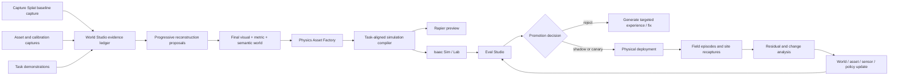

# Capture Splat + World Studio: Dirac-Inspired Real2Sim, Evals, Deployments, and Asset Factory Roadmap

**Prepared:** 2026-07-29  
**Repositories:** `sandeep-devarapalli/capture-splat`, `sandeep-devarapalli/world-studio`

## Source note

The current Dirac Robotics homepage and its shipped-asset summaries were directly readable. The `/real2sim`, `/evals`, and `/deployments` routes are client-rendered and did not expose readable page bodies to the research crawler. This plan therefore does not invent exact copy or undocumented implementation details from those routes. It uses:

1. the product surfaces named by those routes and the workflow supplied by the project owner;
2. the directly verifiable Dirac homepage and asset records;
3. World Labs' published Real-to-Sim-to-Real framing;
4. primary research on physics-aware asset generation and real-to-sim policy evaluation;
5. current NVIDIA Isaac Sim/Lab architecture and evaluation guidance;
6. the current Capture Splat and World Studio public roadmaps.

## Executive decision

Capture Splat and World Studio should become four connected products rather than one reconstruction feature:

1. **Real2Sim Compiler** — capture a site, robot, sensors, assets, task, and demonstrations; produce a task-scoped simulation with explicit evidence and uncertainty.
2. **Physics Asset Factory and Registry** — create reusable, versioned assets with visual, metric, collision, semantic, articulation, and physics layers plus validation evidence.
3. **Eval Studio** — run policies across controlled world, asset, sensor, physics, and embodiment variations; identify failures, rank policies, and decide what is safe to test on hardware.
4. **Deployment Twin and R2S2R Operations** — bind each physical site and robot deployment to exact world, asset, robot, task, policy, and calibration versions; ingest field evidence; detect environmental change; create World v2; rerun impacted evals; canary and roll back.

The product promise should be:

> Capture reality, validate it against the task, screen policies before hardware, and keep the simulation synchronized with the deployment as the real site changes.

The public technical claim should remain scoped:

> Physics-calibrated within a validated robot, task, sensor, environment, and operating envelope.

Do not claim that a passive iPhone video creates universally physics-accurate mass, friction, stiffness, articulation, or deformable dynamics.

---

# 1. Product ownership boundary

## Capture Splat owns authoritative evidence capture

Capture Splat should own:

- durable local-first RGB/video recording;
- accepted RGB-D keyframes;
- ARKit camera poses, intrinsics, gravity, IMU, depth, confidence, mesh, planes, and masks;
- robot, sensor, task, and site identity at capture time;
- guided asset-orbit captures;
- guided physical calibration trials;
- task demonstrations and matched open-loop scripts;
- deployment recaptures and change-evidence packages;
- synchronized field episode references;
- checksums, clock mappings, quality telemetry, and apparatus provenance.

It must not promote physics parameters. It records the evidence from which World Studio may later fit and validate them.

## World Studio owns the compiled world and operational loop

World Studio should own:

- immutable World versions and parent/delta lineage;
- visual, metric, collision, navigation, semantic, physics, and task layers;
- objectization and asset instance/class relationships;
- physical parameter fitting and uncertainty;
- physics asset registry and simulator builds;
- Real2Sim Promise certificates;
- TaskSpec compilation and review;
- simulator adapters, initially Rapier and external Isaac Sim/Lab;
- evaluation suites, policies, variations, runs, reports, and promotion decisions;
- deployment registry, environment revisions, field episodes, drift reports, canary releases, and rollback;
- R2S2R residual analysis and change impact graphs.

## Representation authority remains separated

```text
Source RGB/video                    -> visual evidence
Metric RGB-D / fused point cloud    -> registration, coverage, geometry evidence
Gaussian PLY/SPZ/SOG/RAD            -> photoreal appearance and visual sensor rendering
TSDF/ESDF/SDF                       -> fused surface, occupancy, free-space, clearance
Mesh/primitives/heightfields        -> collision, raycasts, navigation, contacts
Semantic/object/part graph          -> identity, relations, affordances, change analysis
Physics manifest + simulator layer  -> mass, inertia, friction, compliance, joints, drives
Episodes                            -> actual actions, observations, contacts, outcomes
```

Gaussian appearance may follow the transforms of simulated objects, but it does not automatically become collision or dynamics authority.

---

# 2. Dirac product surface to Capture Splat / World Studio mapping

| Dirac-style surface | Capture Splat responsibility | World Studio responsibility | Customer-visible output |
|---|---|---|---|
| Real2Sim | Record the site, robot, sensors, objects, task brief, demonstrations, calibration trials, and evidence | Compile a versioned task-aligned world, calibrate it, validate it, and generate simulator builds | A Real2Sim Promise certificate and runnable world |
| Asset Pack | Object Orbit, dimensions, scale, apparatus, compression/slide/roll/drop/pendulum evidence | Objectization, visual/collision/articulation/physics asset builds, confidence, validation, registry | A Physics Asset Passport plus Isaac/OpenUSD, GLB/SPZ, collision and metadata packages |
| Evals | Supply real episodes and synchronized evaluation setup evidence | Define suites and variations, run policies, map failure regions, rank checkpoints, gate hardware testing | Eval report, regression gate, policy promotion decision |
| Deployments | Capture baseline, recaptures, field snapshots, robot logs, interventions, and site-change evidence | Maintain deployment twin, detect and classify deltas, rerun impacted evals, canary, promote, roll back | Deployment health, world freshness, change impact, safe release history |
| R2S2R loop | Return evidence from the actual deployment | Determine whether the mismatch is world, asset, sensor, robot, task, controller, or policy; create World/Asset/Policy updates | A continuously improving deployment rather than a one-off simulation |

---

# 3. The Real2Sim Promise

The Real2Sim Promise should be a machine-readable and human-readable contract, not a marketing adjective.

## 3.1 Contract fields

Proposed schema: `world_studio.real2sim_promise.v0.1`

```json
{
  "promise_id": "rsp_...",
  "world_version": "world_...@v12",
  "robot_profile": "robot_...@v4",
  "sensor_profile": "sensor_...@v6",
  "task_spec": "task_...@v3",
  "simulator_builds": ["rapier@...", "isaac@..."],
  "validated_envelope": {
    "site_regions": ["kitchen", "hall"],
    "object_classes": ["chair", "wheelchair", "table"],
    "lighting": {"lux": [150, 900]},
    "floor_friction": {"range": [0.45, 0.70]},
    "robot_speed_mps": [0.0, 0.6]
  },
  "evidence": [],
  "metrics": [],
  "known_unknowns": [],
  "approved_for": [],
  "not_approved_for": [],
  "freshness": {
    "last_site_validation": "...",
    "expiry": "...",
    "revalidation_triggers": []
  },
  "decision": "promote|hold|reject"
}
```

## 3.2 Promise gates

A promise may be promoted only when all applicable gates pass:

1. **Evidence integrity:** complete capture manifests, checksums, clocks, source versions, and safe paths.
2. **Metric alignment:** scale, axes, gravity, frame graph, camera poses, and point/mesh alignment validated.
3. **Visual alignment:** held-out camera render comparisons and sensor-domain color/exposure alignment.
4. **Structural alignment:** floors, walls, openings, free space, object states, and collision checked for the target task.
5. **Sensor alignment:** camera, depth, LiDAR, IMU, odometry, latency, and noise models checked where relevant.
6. **Matched open-loop validation:** identical action/script sequences run in simulation and reality; observations, trajectories, contacts, object motion, and outcomes compared.
7. **Held-out interaction validation:** calibration trials and held-out trials remain separate; tuned parameters must improve held-out residuals over simulator defaults.
8. **Predictive eval validation:** the simulation identifies materially similar failure conditions and preserves policy rankings strongly enough for the declared decision.
9. **Freshness:** no unresolved environment change invalidates the tested envelope.
10. **Human-readable scope:** explicit approved and prohibited uses.

## 3.3 Promise levels

| Level | Meaning |
|---|---|
| P0 Evidence Reconciled | Source evidence is durable and replayable |
| P1 Visually Aligned | Appearance and camera views pass declared QA |
| P2 Metric Structure | Scale, frames and geometry pass task-scoped metric gates |
| P3 Navigation Ready | Static collision/free space is validated for one mobile robot |
| P4 Sensor Aligned | Target sensor outputs and timing pass conformance |
| P5 Rigid Asset Calibrated | Selected rigid/rolling assets pass held-out interaction tests |
| P6 Articulated Asset Calibrated | Joints, brakes, drives and articulation pass held-out tests |
| P7 Predictive Eval | Failure regions and policy ranking are predictive within scope |
| P8 Deployment Maintained | Field deltas, revalidation, canary and rollback are operational |

The initial product should target P3-P5 for indoor mobile robots and unoccupied rolling assets before pursuing general manipulation or deformables.

---

# 4. Physics Asset Factory and Asset Pack

## 4.1 Asset record design

Proposed schema: `world_studio.physics_asset.v0.1`

Each record needs:

- asset class and exact physical instance identity;
- source capture/session hashes;
- canonical coordinate frame, units, dimensions, and scale evidence;
- visual assets: canonical Gaussian PLY, SPZ/SOG/RAD, optional PBR mesh;
- metric geometry: point cloud, surface mesh, uncertainty map;
- collision assets: triangle mesh, convex decomposition, primitives, SDF if applicable;
- semantic part graph and affordances;
- articulation graph: links, joints, axes, limits, drives, brakes, latches;
- physical parameters with units, source class, uncertainty, simulator/contact-model scope;
- validation trials and held-out trials;
- simulator builds and compatibility matrix;
- `approved_for`, `not_approved_for`, expiry and revalidation triggers;
- version lineage and change log.

## 4.2 Asset maturity levels

| Level | Deliverable |
|---|---|
| A0 Visual | Appearance proposal only |
| A1 Metric | Dimensions, scale, canonical frame, geometry uncertainty |
| A2 Collision | Validated collision LoDs and penetration/contact checks |
| A3 Rigid Physics | Mass, COM, inertia, friction, restitution or rolling resistance as applicable |
| A4 Articulated/Compliant | Joints, limits, drives, brakes, stiffness and damping |
| A5 Task Validated | Held-out real/sim interaction within a declared task envelope |
| A6 Deployment Validated | Field episodes show the asset supports deployment decisions |

## 4.3 Purple chair-style asset pipeline

For an upholstered chair:

1. **Object Orbit capture:** RGB-D, masks, camera path, close-range details, underside, legs, seat and back.
2. **Known measurements:** dimensions, mass, leg/seat heights and material notes.
3. **Objectization:** frame, cushion/seat, back, legs and contact surfaces as parts.
4. **Appearance:** Gaussian/SPZ plus optional PBR mesh.
5. **Collision:** rigid frame and simplified contact geometry; cushion represented separately.
6. **Calibration:** floor friction, tipping/push trial, cushion compression, damping/recovery, optional pendulum/inertia test.
7. **Validation:** unseen push directions, different floor patch, load case, stable resting and maximum penetration tests.
8. **Asset Passport:** parameter values, uncertainty, provenance and task scope.

## 4.4 Wheelchair asset pipeline

A wheelchair is a better strategic test than a simple chair because it exercises rolling, articulation, brakes, caster dynamics, compliance, changing load and navigation interaction.

### Part graph

```text
wheelchair_root
├── frame
├── left_rear_wheel
├── right_rear_wheel
├── left_front_caster_fork
│   └── left_front_caster_wheel
├── right_front_caster_fork
│   └── right_front_caster_wheel
├── left_brake
├── right_brake
├── footrests
├── armrests
├── seat_cushion
└── back_cushion
```

### Required evidence

- wheel and caster radii, axle spacing, caster trail, seat height and overall bounds;
- mass, unloaded COM and inertia estimate;
- load variants, beginning with an instrumented ballast fixture rather than a person;
- rolling resistance and coast-down tests;
- straight push force and yaw/pivot response;
- caster swivel friction and settling;
- brake engagement and holding force;
- threshold/curb interaction for declared heights;
- floor material pairs;
- seat/back compression and damping only where the robot task needs it;
- collision penetration and articulation limits.

### Initial approved scope

Start with an **unoccupied wheelchair as a movable rolling obstacle or robot-interaction asset**. Do not position the first version as medical-device validation, human safety certification, occupant biomechanics, or autonomous wheelchair control.

## 4.5 Asset registry product

World Studio should support three registries:

1. **Private customer registry** — exact site and hardware instances; default product priority.
2. **Team/shared registry** — reusable assets across customer projects with controlled access.
3. **Public/community registry** — requests, voting, downloadable validated assets and transparent limitations.

The community voting mechanism is useful, but it should follow customer-driven asset creation, not replace it. Prioritize assets by deployment impact, eval coverage and repeated customer demand.

## 4.6 OpenUSD/Isaac packaging

Use a modular package:

```text
asset_name/
├── asset.usd
├── source/
├── payloads/
│   ├── base.usda
│   ├── geometries.usd
│   ├── instances.usda
│   ├── materials.usda
│   └── visual_gaussian.*
├── features/
│   ├── physics.usda
│   ├── physx.usda
│   ├── mujoco.usda
│   ├── semantics.usda
│   ├── sensors.usda
│   └── ros.usda
├── validation/
└── asset-passport.json
```

Preserve source bytes and use payloads/variants for simulator-specific physics, load variants, collision LoDs, material pairs and optional features.

---

# 5. Eval Studio

## 5.1 Product goal

Eval Studio must answer four questions:

1. Where does a policy succeed and fail?
2. Which policy/checkpoint is better?
3. Which conditions cause failure?
4. Does a simulated improvement predict a hardware improvement?

Absolute simulation success rate is secondary to decision validity.

## 5.2 Core contracts

- `world_studio.eval_suite.v0.1`
- `world_studio.eval_case.v0.1`
- `world_studio.eval_run.v0.1`
- `world_studio.policy_artifact.v0.1`
- `world_studio.embodiment_adapter.v0.1`
- `world_studio.eval_report.v0.1`
- `world_studio.promotion_decision.v0.1`

An EvalSuite references exact World, Asset, Robot, Sensor, Task and Promise versions. An EvalRun references the policy hash, simulator/runtime build, random seed and every sampled variation.

## 5.3 Variation dimensions

The first variation system should cover:

- robot start pose and state;
- movable-object states and configurations;
- clutter and temporary obstacles;
- lighting, exposure and viewpoint;
- sensor noise, dropout, occlusion, clock offset and latency;
- floor friction, rolling resistance and selected asset-parameter uncertainty;
- robot wheel radius, wheelbase, control delay and actuator response;
- environment revisions and known deployment changes;
- task difficulty and ID/OOD partitions;
- embodiment and sensor-stack swaps where the task contract permits.

Every variation must be declared, sampled deterministically and recorded with the episode result.

## 5.4 Metrics

### Task metrics

- success/failure and reason;
- time, coverage, throughput and energy;
- collision/contact forces and forbidden-region violations;
- human intervention, pause and recovery count;
- near-miss and safety-rule events.

### Real/sim alignment metrics

- observation residuals and perceptual embedding residuals;
- camera/depth/LiDAR projection error;
- trajectory ATE/RPE and stopping/turning residuals;
- object pose, contact, force and deformation residuals;
- outcome agreement and near-boundary behavior agreement.

### Predictivity metrics

- policy rank correlation, such as Spearman/Kendall;
- improvement direction agreement across checkpoints;
- failure-region overlap and high-severity failure recall;
- calibration of simulated confidence versus real outcomes;
- false-safe rate: simulation passes cases that fail materially in reality;
- regression detection recall and false alarms.

## 5.5 Evaluation workflow

```text
Register policy/checkpoint
      ↓
Resolve exact world/asset/robot/task versions
      ↓
Generate deterministic ID, OOD and deployment-specific cases
      ↓
Run local smoke tests
      ↓
Run Isaac/Lab batch evaluation
      ↓
Sensitivity and failure-region analysis
      ↓
Select a bounded hardware validation set
      ↓
Run matched real episodes
      ↓
Compute predictivity and Real2Sim Promise status
      ↓
Reject / shadow / canary / promote / rollback
```

## 5.6 Eval UI without adding a seventh mode

Preserve World Studio's six modes:

- **Simulate:** suite authoring, variation previews, batch execution.
- **Sensors:** sensor-model and timing conformance.
- **Pilot:** matched open-loop scripts and teleoperation.
- **Episode:** run table, replay, failure clusters, heatmaps, policy ranking, promotion decision.
- **View/Edit:** inspect the exact world and assets behind a failed case.

---

# 6. Deployment Twin and continuously changing environments

## 6.1 Deployment record

Proposed schema: `world_studio.deployment.v0.1`

A deployment binds:

```text
Customer / Site / Zone
World version
Asset instance versions
Robot and sensor profile
TaskSpec
Policy/controller version
Real2Sim Promise
Eval gate and release decision
Deployment channel: shadow / canary / production
```

## 6.2 Four types of change

Do not treat every difference as a full-world rebuild.

1. **State change:** known objects moved, doors opened, temporary clutter appeared.
2. **Structural/environment change:** walls, racks, floor, fixtures or workcell geometry changed.
3. **Robot/sensor change:** calibration, camera mount, wheel wear, payload, firmware or hardware changed.
4. **Task/policy change:** new objective, new policy checkpoint, updated constraints or operating envelope.

Each change type has different affected artifacts and evals.

## 6.3 Recapture and change detection

Capture Splat adds a `Deployment Recapture` intent:

1. select deployment and site zone;
2. relocalize into the existing World frame using persistent visual features, anchors or markers;
3. record targeted RGB-D/mesh evidence and a short environment walkthrough;
4. capture robot/sensor calibration checks if required;
5. preserve all changes as proposals;
6. upload a checksum-bound `site_delta_evidence` package.

World Studio then computes:

- image, depth, point-cloud, mesh and semantic differences;
- object state and identity changes;
- new, removed, moved and modified assets;
- free-space and route impact;
- sensor-domain changes;
- known/unknown and confidence regions.

It creates `World vN+1` as an immutable delta, never overwriting `World vN`.

## 6.4 Change impact graph

A site delta should answer:

- which tasks and routes intersect the changed region;
- which assets and collision/navigation products are affected;
- which sensor views are affected;
- which Real2Sim Promises are stale or invalid;
- which eval cases must rerun;
- whether a full reconstruction, local patch, asset replacement or metadata-only update is sufficient.

## 6.5 Field episode ingestion

Every real run should record:

```text
world version
asset versions
robot/sensor profile
policy/controller hash
task version
commands/actions
TF/odometry
sensor observations
contacts/events/interventions
outcome and failure reason
environment snapshot or recapture reference
operator notes
checksums and clock alignment
```

## 6.6 Closed operational loop

```text
Field anomaly or scheduled recapture
      ↓
Classify mismatch:
  environment / asset / sensor / robot / task / controller / policy
      ↓
Replay against exact deployment twin
      ↓
Propose a world, asset, model, calibration or task update
      ↓
Run only impacted regression suites plus required global safety suites
      ↓
Shadow or canary release
      ↓
Monitor field episodes and compare to the promise
      ↓
Promote, expand, hold or roll back
```

## 6.7 Deployment reliability features

- world freshness score per zone, not one global binary status;
- revalidation triggers based on time, change, incident and hardware maintenance;
- drift budgets for geometry, sensors, dynamics and policy predictivity;
- scheduled sentinel routes or robot self-check episodes;
- shadow replay of production observations in simulation;
- canary cohorts and automatic rollback criteria;
- complete audit trail linking every production run to a promise and eval gate;
- fail-closed behavior when the current environment falls outside the validated envelope.

---

# 7. Full R2S2R architecture



The progressive geometry and 3DGS work remains useful, but it feeds the evidence graph:

- immediate ARKit RGB-D/mesh and trajectory;
- LingBot-inspired owned streaming geometry proposals;
- i3dgs-inspired progressive Gaussian/submap revisions;
- FastGS-inspired final density control and acceleration;
- global COLMAP/HLOC and controlled final 3DGS as the final visual baseline;
- metric fusion and separately validated collision/navigation as physical structure;
- Rapier for local preview and Isaac for high-fidelity robot/sensor evaluation.

---

# 8. Capture Splat roadmap changes

Preserve the current completed Live Session Foundation and next Authenticated Sender work. Add the following milestones.

## CS-R2S1: Task, Robot and Site Brief

Outcome: capture begins with a typed deployment context rather than an anonymous scan.

Required:

- site/deployment/zone identity;
- robot and sensor profile references;
- natural-language goal plus typed TaskSpec draft;
- work, excluded and safety-critical regions;
- required Real2Sim Promise level;
- consent/privacy and data-retention policy.

Acceptance:

- strict schema and migrations;
- task terms unresolved by grounding remain `hold`;
- no task text changes accepted-frame capture gates.

## CS-R2S2: Asset Capture and Calibration Trial Modes

Outcome: Capture Splat records evidence needed for Purple-chair and wheelchair-class assets.

Add intents:

- `Physics Asset Orbit`;
- `Dimension and Scale Evidence`;
- `Slide / Ramp`;
- `Push / Tip`;
- `Drop / Restitution`;
- `Compression / Recovery`;
- `Pendulum / Inertia`;
- `Roll / Coast-down / Brake`;
- `Articulation Range`.

Acceptance:

- apparatus identity, calibration, uncertainty and timing captured;
- raw evidence preserved;
- trials can be paired into fit and holdout groups;
- no on-device physics authority claim.

## CS-R2S3: Matched Open-Loop and Task Demonstration Capture

Outcome: one script/demonstration can be replayed against simulation and reality.

Required:

- robot commands/actions and timestamps;
- robot joint/odometry/sensor streams or rosbag references;
- task and initial-state alignment evidence;
- operator intervention and outcome markers;
- shared clock model and dropped-sample accounting.

## CS-R2S4: Deployment Recapture and Change Evidence

Outcome: targeted recapture updates a deployed world without rebuilding it blindly.

Required:

- deployment/World/zone selection;
- relocalization evidence;
- local delta capture and coverage guidance;
- before/after anchors;
- changed/unchanged/unknown proposal masks;
- field episode and incident linking.

Acceptance:

- recapture cannot mutate the prior world;
- out-of-envelope or failed relocalization remains `hold`;
- deterministic delta manifests and reconciliation.

## CS-R2S5: Physical Device Acceptance

Outcome: release-level capture reliability for baseline, assets, trials and recaptures.

Acceptance:

- supported LiDAR iPhone matrix;
- startup, thermal, storage, writer-drop, network interruption, resume and two-cycle finalization;
- time synchronization and apparatus recording validation;
- privacy/PII redaction options for deployment captures.

---

# 9. World Studio roadmap changes

Recommended public milestone sequence:

| Milestone | Revised outcome |
|---|---|
| M0 Live Evidence Foundation | Keep completed |
| M1 Authenticated LAN and Progressive World | Keep; add generic isolated worker lifecycle |
| M2 Canonical World, Asset and Delta Graph | Immutable worlds, asset instances, site deltas, transform graph and reversible edits |
| M3 Indoor Navigation and First Deployment Twin - P3 | Validated mobile robot/vacuum baseline plus recapture/change workflow |
| M4 Physics Asset Factory and Registry - A0-A4 | Purple-chair-class and unoccupied-wheelchair assets with passports and private registry |
| M5 Isaac/ROS Sensor and Asset Conformance - P4 | Layered OpenUSD compiler, asset variants, remote Isaac worker, sensor parity |
| M6 Real2Sim Promise and Matched Calibration - P5/P6 | Open-loop validation, held-out system identification, promise certificates |
| M7 Predictive Eval Studio - P7 | Policy ranking, failure regions, sensitivity, regression and hardware-screening gates |
| M8 Deployment Operations and Continuous R2S2R - P8 | Fleet/site registry, freshness, field episodes, delta worlds, canary and rollback |
| M9 Expanded Embodiments | UAV, vehicles, manipulation and deformables with separate readiness gates |

## Required documentation changes

Update:

- `ROADMAP.md`;
- `docs/blueprints/world-compiler-v0.1/MILESTONES.md`;
- `docs/blueprints/world-compiler-v0.1/ADOPTION_STATUS.md`;
- `docs/blueprints/world-compiler-v0.1/PHYSICAL_ASSET_CALIBRATION.md`;
- `docs/blueprints/world-compiler-v0.1/NEXT_IMPLEMENTATION_PROMPT.md`;
- `docs/upstreams.md`.

Add:

- `REAL2SIM_PROMISE.md`;
- `ASSET_FACTORY_AND_REGISTRY.md`;
- `EVAL_STUDIO.md`;
- `DEPLOYMENT_TWIN.md`;
- `R2S2R_OPERATIONS.md`;
- proposal schemas and examples under the existing blueprint proposal area.

## Product UI mapping

Do not add new top-level modes. Extend the existing six:

| Mode | New responsibility |
|---|---|
| View | World freshness, site revisions, visual/metric/collision/uncertainty and change overlays |
| Edit | Objectization, asset parts/joints, delta review, reversible promotion |
| Simulate | Real2Sim compile, physics trials, variations, batch eval jobs |
| Pilot | Matched open-loop scripts, teleoperation and initial-state alignment |
| Sensors | Apparatus, robot/sensor calibration, clock and residual tools |
| Episode | Eval runs, real/sim pairs, failure regions, policy ranking, deployments, canary and rollback decisions |

---

# 10. Proposed contracts

Keep these as design proposals until runtime implementation, migrations and round-trip tests exist.

## Capture Splat

- `capture_splat.task_brief.v0.1`
- `capture_splat.asset_capture.v0.1`
- `capture_splat.calibration_trial.v0.1`
- `capture_splat.task_demonstration.v0.1`
- `capture_splat.deployment_recapture.v0.1`
- `capture_splat.site_delta_evidence.v0.1`
- `capture_splat.field_episode_reference.v0.1`

## World Studio

- `world_studio.real2sim_promise.v0.1`
- `world_studio.physics_asset.v0.1`
- `world_studio.asset_validation.v0.1`
- `world_studio.eval_suite.v0.1`
- `world_studio.eval_case.v0.1`
- `world_studio.eval_run.v0.1`
- `world_studio.eval_report.v0.1`
- `world_studio.policy_artifact.v0.1`
- `world_studio.deployment.v0.1`
- `world_studio.site_revision.v0.1`
- `world_studio.change_proposal.v0.1`
- `world_studio.field_episode.v0.1`
- `world_studio.promotion_decision.v0.1`

---

# 11. Sixteen-week vertical-slice demonstration

The first full product demonstration should use an indoor mobile robot or vacuum, one furnished room, an upholstered chair and an unoccupied wheelchair.

## Weeks 1-2: contracts and fixtures

- task, asset, calibration, promise, eval and deployment proposal schemas;
- fake simulator and deterministic episodes;
- immutable World/Asset/Deployment IDs and hashes.

## Weeks 3-4: baseline and recapture capture flows

- Capture Splat Task Brief;
- baseline room capture;
- deployment recapture and relocalization fixture;
- task regions and no-go regions.

## Weeks 5-6: asset factory first pass

- chair A0-A3;
- wheelchair A0-A2, then rolling/brake calibration toward A4;
- private registry and Asset Passport UI.

## Weeks 7-8: world and asset compilation

- visual Gaussian/SPZ;
- metric point cloud and fused geometry;
- collision/free-space;
- object and asset instance graph;
- local Rapier preview.

## Weeks 9-10: Isaac/ROS conformance

- layered OpenUSD world and assets;
- spawn and penetration tests;
- robot, sensors, TF/odometry and command interface;
- same TaskSpec in local and Isaac runtimes.

## Weeks 11-12: Real2Sim Promise

- matched route and wheel/turn/stop scripts;
- chair push or wheelchair roll/brake validation;
- held-out trials;
- promise certificate P3-P5.

## Weeks 13-14: Eval Studio

- three policy/controller checkpoints;
- variations in start pose, clutter, chair/wheelchair position, lighting, sensor noise and floor uncertainty;
- failure heatmaps, sensitivity, ranking and hardware shortlist.

## Weeks 15-16: deployment loop

- run the selected policy on the real robot;
- move the wheelchair and alter one route obstacle;
- Capture Splat recapture;
- produce World v2 as a delta;
- identify impacted evals;
- rerun, canary and promote or roll back.

## Demo narrative

1. Scan the room and declare the task.
2. Add physics-calibrated chair and wheelchair assets.
3. Compile to Isaac and run evals.
4. Choose a policy based on the eval gate.
5. Deploy it.
6. Change the real room.
7. Recapture only the changed zone.
8. Show the stale promise and impacted routes.
9. Generate World v2, rerun targeted evals and canary.
10. Show the complete audit trail.

This proves Real2Sim, assets, evals, deployments and the R2S2R loop in one vertical slice.

---

# 12. Initial pilot acceptance targets

These are proposed pilot gates, not current product claims. They must be adjusted and pre-registered for the robot/task/site.

| Area | Initial target |
|---|---|
| Evidence integrity | No missing or conflicting accepted evidence; deterministic reconciliation |
| Known scale | <1% error on controlled known-distance fixtures |
| Gravity/up-axis | <1 degree error |
| Static floor surface | p95 surface error <2 cm in declared navigation zone |
| Safety-critical obstacles | Zero false negatives in the controlled acceptance set |
| Asset dimensions | Within measurement uncertainty; generally <1% for rigid dimensions |
| Simulator spawn | No initial penetrations or unstable resting state |
| Wheelchair rolling/brake | Held-out trajectory/stopping residual below pre-registered task threshold |
| Eval reproducibility | Exact world/policy/seed/config traceability |
| Policy ranking | Spearman rank correlation >=0.8 in the pilot, with confidence interval reported |
| Critical failure recall | >=90% on the controlled real failure set; zero known false-safe critical cases |
| Change detection | >=95% recall for declared structural/movable-object change classes in the pilot |
| Promotion | No production release without passing global safety suite and impacted regression suite |

---

# 13. Differentiation

The differentiation should not be “we also scan an object” or “we also render Gaussians.” It should be the combination of:

- iPhone-first, local-first authoritative evidence;
- progressive capture feedback and final high-quality reconstruction;
- Gaussian appearance plus explicit metric/collision/semantic/physics authority;
- task-scoped Real2Sim Promise rather than a universal accuracy claim;
- reusable asset classes plus calibrated physical instances;
- policy- and embodiment-neutral eval contracts;
- predictive policy ranking and failure-region validation;
- continuously versioned deployment twins;
- delta recapture instead of manual world rebuilding;
- fail-closed promotion, canary and rollback;
- open, self-hostable, provenance-first architecture with external Isaac integration.

The most defensible positioning is:

> Capture Splat records reality. World Studio turns it into a validated, versioned world; tests every policy against the world it will face; and keeps that world current after deployment.
