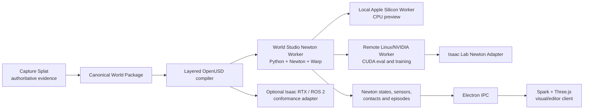

# Newton is now the target physics backend

I updated the complete Capture Splat + World Studio R2S2R plan so that **Newton replaces Rapier as World Studio’s only intended product physics backend**.

Download the complete Newton + R2S2R update bundle (source attachment not included)

The most important files are:

* Direct Codex migration and roadmap prompt (source attachment not included)
* Complete R2S2R roadmap updated for Newton (source attachment not included)
* Newton runtime architecture (source attachment not included)
* Newton migration milestones and PR sequence (source attachment not included)
* Newton solver profiles (source attachment not included)
* Capture Splat → Newton handoff (source attachment not included)
* Isaac Lab Newton integration (source attachment not included)
* Newton changes to Promise, Evals and Deployments (source attachment not included)
* Current repository change map (source attachment not included)
* Validation report (source attachment not included)

---

## The critical architectural correction

This cannot be implemented as:

```text
Remove @dimforge/rapier
Install Newton in the React app
```

Newton’s current implementation is a Python runtime built on NVIDIA Warp, with MuJoCo Warp as its primary backend. Its supported platforms include macOS in CPU-only mode and Linux/Windows with NVIDIA GPU acceleration. The practical architecture is therefore an **out-of-process Newton worker**, not a browser dependency. Newton 1.4.0, released July 16, 2026, is the baseline pinned in the bundle.



### Runtime ownership

| Component         | Responsibility                                                                                   |
| ----------------- | ------------------------------------------------------------------------------------------------ |
| Capture Splat     | Source evidence, metric frames, geometry proposals, calibration trials and deployment recaptures |
| World Studio      | World versions, assets, tasks, Promises, evals, deployments and authority                        |
| Newton            | Dynamics, contacts, joints, physical state, physics sensors and episodes                         |
| Spark + Three.js  | Gaussian/mesh rendering, editing, overlays, interaction and replay                               |
| Isaac Lab Newton  | Parallel policy training and evaluation                                                          |
| Isaac RTX / ROS 2 | Separately validated high-fidelity sensor and robot-interface adapter                            |

This maintains the established project rule: Gaussian splats remain the visual layer, while separately validated mesh, SDF, heightfield, convex or primitive geometry supplies collision.  Spark and Three.js remain the visual composition layer rather than becoming the physics engine.

---

# What changes in the current World Studio implementation

The repository currently has a direct browser-side Rapier implementation:

* `apps/web/package.json` depends on `@dimforge/rapier3d-compat`.
* `apps/web/src/simulation.ts` directly imports Rapier and implements `RapierWalkSimulation` and `RapierSimulation`.
* The shared diagnostics contract only recognizes `rapier3d-compat` or `unavailable`.

Codex should replace that architecture as follows:

| Current                                     | Target                                                 |
| ------------------------------------------- | ------------------------------------------------------ |
| Rapier executes inside the browser renderer | Newton executes in a supervised Python worker          |
| `RapierSimulation`                          | Solver-neutral `SimulationClient`                      |
| Browser creates worlds and colliders        | Worker loads compiled World/OpenUSD artifacts          |
| Direct JavaScript state access              | Ordered, typed simulation-state messages               |
| Rapier-specific diagnostics                 | Newton/Warp/solver/device/version diagnostics          |
| Browser fallback movement                   | Fail-closed `Newton worker unavailable` state          |
| One local WebAssembly engine                | Local CPU worker plus authenticated remote CUDA worker |
| Rapier Episode state                        | Newton state/contact/sensor Episode v0.2               |

The Electron main process already owns filesystem and local service IPC responsibilities, making it the correct place to supervise the Newton process rather than allowing the sandboxed renderer to spawn it.

---

# Rapier removal policy

The architecture changes **now**, but removing working code should occur through a controlled cutover:

1. Freeze all Rapier feature work.
2. Capture temporary parity fixtures for spawn, movement, collisions, props and Episodes.
3. Introduce a solver-neutral TypeScript interface.
4. Add the Electron worker supervisor.
5. Add the Newton worker.
6. reproduce existing behavior in Newton;
7. switch the active Simulate and Pilot paths to Newton;
8. make browser-only physics fail closed;
9. remove Rapier package, classes, tests, UI text and bundle chunks.

Rapier will not remain a user-selectable backend, a silent fallback or a second physics authority. It survives only temporarily on the migration branch until Newton parity and Episode migration pass.

---

# Local Mac versus remote GPU

Newton can run on macOS, but it is CPU-only there. The following Newton features currently require an NVIDIA GPU and should be blocked on the Mac capability profile:

* SDF collision;
* SDF mesh-to-mesh contact;
* hydroelastic contacts;
* tiled camera rendering;
* Implicit MPM;
* tile-based VBD. ([Newton Physics][1])

Therefore:

```text
MacBook / Apple Silicon
    static indoor world validation
    spawn and route preview
    bounded rigid bodies
    CPU MuJoCo
    contact, IMU and raycast probes
    editor interaction
    deterministic small episodes

Linux / NVIDIA
    GPU MuJoCo Warp
    thousands of parallel evals
    policy training
    CUDA graphs where supported
    SDF/hydroelastic experiments
    high-volume sensors
    deformables and multiphysics research
```

Newton’s `SolverMuJoCo` explicitly supports both MuJoCo CPU and MuJoCo Warp modes through `use_mujoco_cpu`, and supports selecting either MuJoCo contacts or Newton’s own contact pipeline. ([Newton Physics][2])

---

# Default World Studio solver profile

The first production profile should be:

```text
newton-mujoco-rigid-v1

Newton: 1.4.0
Solver: SolverMuJoCo
Mac: use_mujoco_cpu=true
Linux/NVIDIA: MuJoCo Warp
deterministic=true
fixed physics timestep
fixed substeps
explicit contact pipeline
primitive/convex/heightfield collision preferred
task-preserving static mesh only after validation
```

Newton includes multiple solvers, but they do not have identical capabilities or parameter meanings. MuJoCo is appropriate for the first rigid and articulated robot profile; Kamino and VBD should remain experimental, while MPM and coupled multiphysics should remain research tracks. ([Newton Physics][3])

## Important collision warning

MuJoCo’s native path supports only convex mesh collision. A non-convex captured room mesh can be convex-hulled, potentially closing doorways or creating false obstacles. World Studio must either:

* generate task-preserving convex decomposition;
* use primitives or heightfields;
* use a validated Newton collision pipeline;
* or reject the artifact.

It must compare the **effective collider** against Capture Splat’s metric geometry before promoting navigation or collision authority. ([Newton Physics][4])

---

# Isaac changes after Newton adoption

Isaac Lab 3.0’s multi-backend architecture now supports Newton as a selectable physics backend, with MuJoCo Warp as its primary validated Newton path. It also supports kit-less Newton operation without requiring Isaac Sim. However, the Newton integration is currently beta, with incomplete and still-maturing task coverage. ([Isaac Sim][5])

The new relationship should be:

```text
Standalone Newton
    canonical local/remote World Studio physics

Isaac Lab Newton
    policy training and parallel evaluation adapter

Isaac RTX
    optional high-fidelity rendering/sensor adapter

Isaac Sim / ROS 2
    optional robot-interface and system-conformance adapter
```

Isaac Lab separates physics, renderer and visualizer selection, and its `SceneDataProvider` can expose authoritative Newton state to renderer/visualizer consumers. Nevertheless, each Newton + renderer + sensor + ROS combination must pass a task-specific conformance suite rather than being assumed to work. ([Isaac Sim][6])

---

# R2S2R remains the core product

Newton does not replace the Real2Sim Promise, Asset Factory, Eval Studio or Deployment Twin. It becomes their execution substrate.

The Real2Sim Promise will now bind:

```json
{
  "physics_engine": "newton",
  "physics_version": "1.4.0",
  "solver_profile": "newton-mujoco-rigid-v1",
  "contact_pipeline": "mujoco",
  "device": "cuda:0",
  "deterministic": true,
  "physics_dt_s": 0.004166666667,
  "substeps": 4,
  "world_hash": "sha256:...",
  "adapter_conformance": {
    "isaac_lab_newton": "promote",
    "isaac_rtx_ros": "hold"
  }
}
```

Every Eval, Asset Passport and Deployment must preserve the exact Newton, Warp, MuJoCo, solver-profile, device, timestep, substep, seed and world-version information.

This continues to follow the World Labs R2S2R requirement: validate matched real and simulated open-loop interactions, reproduce task-relevant observations and dynamics, actively search failure conditions, preserve policy rankings and use field outcomes to improve the next world and policy.

---

# Capture Splat does **not** install Newton

Capture Splat remains simulator-independent. It should add a Newton-ready handoff document and manifest fields for:

* canonical meter units and gravity;
* coordinate frame and transform graph;
* visual Gaussian;
* metric points;
* collision representation type;
* finite vertices and indices;
* triangle winding;
* convex decomposition or simplification provenance;
* floor, wall, opening and unknown regions;
* object-local visual and collision frames;
* direct measurement and calibration evidence;
* uncertainty;
* source hashes;
* approved and prohibited use.

World Studio then validates whether the artifacts actually import and behave correctly in the chosen Newton profile.

Read the Capture Splat Newton handoff specification (source attachment not included)

---

# Proposed updated World Studio milestones

| Milestone | Outcome                                          |
| --------- | ------------------------------------------------ |
| M0        | Live Evidence Foundation                         |
| M1        | Authenticated LAN and Progressive World          |
| M2        | Canonical World, Asset and Delta Graph           |
| M3        | Indoor Navigation and First Deployment Twin — P3 |
| M4        | Physics Asset Factory — A0–A4                    |
| **M5**    | **Newton Runtime and OpenUSD Foundation**        |
| **M6**    | **Newton/Isaac Lab/ROS Sensor Conformance — P4** |
| M7        | Real2Sim Promise and Rigid Calibration — P5/P6   |
| M8        | Predictive Eval Studio — P7                      |
| M9        | Deployment Operations and Continuous R2S2R — P8  |
| M10       | Expanded Embodiments and Multiphysics            |

The bundle includes the precise PR sequence from contracts and worker supervision through Newton cutover, Rapier deletion, remote CUDA evaluation, Isaac Lab integration and deployment operations.

---

# Validation and publication status

The bundle contains four proposal schemas:

* Newton capabilities;
* solver profile;
* Newton job;
* simulation state.

All four positive examples validated successfully, and the negative unsafe-path fixture was rejected.

I was not able to run the complete World Studio or Capture Splat test suites because the repositories could not be cloned into the execution container. No GitHub branch, commit or pull request was created in this turn. Physical accuracy, Newton import compatibility, GPU execution and Isaac conformance remain evidence-dependent rather than established by the roadmap alone.

The file to give Codex first is:

**CODEX_NEWTON_MIGRATION_AND_ROADMAP_PROMPT.md** (source attachment not included)

[1]: https://newton-physics.github.io/newton/1.1.0/guide/installation.html "https://newton-physics.github.io/newton/1.1.0/guide/installation.html"
[2]: https://newton-physics.github.io/newton/stable/api/_generated/newton.solvers.SolverMuJoCo.html "https://newton-physics.github.io/newton/stable/api/_generated/newton.solvers.SolverMuJoCo.html"
[3]: https://newton-physics.github.io/newton/stable/solvers/index.html "https://newton-physics.github.io/newton/stable/solvers/index.html"
[4]: https://newton-physics.github.io/newton/1.4.0/solvers/mujoco.html "https://newton-physics.github.io/newton/1.4.0/solvers/mujoco.html"
[5]: https://isaac-sim.github.io/IsaacLab/release/3.0.0-beta2/source/overview/core-concepts/physical-backends/newton/index.html "https://isaac-sim.github.io/IsaacLab/release/3.0.0-beta2/source/overview/core-concepts/physical-backends/newton/index.html"
[6]: https://isaac-sim.github.io/IsaacLab/release/3.0.0-beta2/source/overview/core-concepts/multi_backend_architecture.html "https://isaac-sim.github.io/IsaacLab/release/3.0.0-beta2/source/overview/core-concepts/multi_backend_architecture.html"
