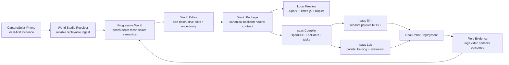

# World Studio on CaptureSplat
## Evidence-backed real-to-sim-to-real platform and NVIDIA Isaac integration blueprint

**Research and architecture date:** 29 July 2026  
**Primary use:** handoff to Codex and engineering planning  
**Initial product wedge:** indoor mobile robots and robot vacuums

## Executive decision

Build **World Studio as an evidence-backed world compiler and orchestration layer**, not as another simulator and not as only a Gaussian-splat editor.

The product boundary should be:

- **CaptureSplat owns authoritative capture evidence.** It records locally first and never allows networking to delay or corrupt acquisition.
- **World Studio owns the progressive world, edit history, coordinate frame, units, provenance, uncertainty, semantic scene graph, robot profiles, tasks, clocks, episode history, and validation state.**
- **Renderers and simulators are adapters.** Spark + Three.js + Rapier provide the immediate local preview. NVIDIA Isaac Sim/Lab is the first high-fidelity training and evaluation backend. AirSim, CARLA, MuJoCo, and other runtimes can follow without becoming the canonical store.
- **No representation silently becomes authoritative for another purpose.** A beautiful splat is not automatically a collider; an inferred label is not automatically an affordance; an estimated friction value is not automatically trusted physics.

The product statement should be:

> **Capture a place once. World Studio turns the evidence into a versioned, editable, simulation-ready world; compiles it into the robotics runtime you use; and improves the world whenever real deployments return new evidence.**

## The core differentiated loop

## What the bundle contains

- [`docs/01_product_strategy.md`](docs/01_product_strategy.md) — positioning, competitive differentiation, wedge, moat, scope, readiness levels.
- [`docs/02_system_architecture.md`](docs/02_system_architecture.md) — canonical world package, authority model, representation stack, services, data flow.
- [`docs/03_isaac_integration.md`](docs/03_isaac_integration.md) — exact Isaac Sim/Lab integration architecture, OpenUSD layers, worker topology, ROS 2 boundary, licensing.
- [`docs/04_validation_r2s2r.md`](docs/04_validation_r2s2r.md) — visual/geometry/physics/policy validation and the real-to-sim-to-real feedback loop.
- [`docs/05_implementation_roadmap.md`](docs/05_implementation_roadmap.md) — ordered phases, acceptance gates, engineering workstreams, first demonstration.
- [`CODEX_PROMPT.md`](CODEX_PROMPT.md) — a direct implementation prompt for Codex.
- [`contracts/world_studio_world_v0.1.schema.json`](contracts/world_studio_world_v0.1.schema.json) — proposed canonical world manifest schema.
- [`contracts/capture_splat_live_session_v0.1.schema.json`](contracts/capture_splat_live_session_v0.1.schema.json) — proposed replayable transport envelope.
- [`contracts/isaac_job_v0.1.schema.json`](contracts/isaac_job_v0.1.schema.json) — proposed compile/run/evaluate job contract.
- [`examples/`](examples/) — minimal world, robot, task, and Isaac job examples.
- [`RESEARCH_SOURCES.md`](RESEARCH_SOURCES.md) — current primary sources and what each supports.

## Non-negotiable architecture rules

1. The phone writes accepted evidence locally before upload.
2. Every transferred object has sequence identity, byte length, SHA-256, ACK state, retry state, and resume behavior.
3. All derived assets point back to source evidence and worker versions.
4. Metric scale and coordinate transforms are explicit and shared across splat, mesh, collider, semantics, robot, and simulator exports.
5. Gaussian splats are appearance authority only unless a separate process promotes derived geometry.
6. Collision meshes and navigation products require validation gates.
7. Estimated mass, friction, restitution, stiffness, damping, and deformability carry ranges, evidence, and confidence.
8. World Studio is backend-neutral; Isaac-specific data lives in an adapter/output layer.
9. Real-world outcomes can create a new world version but never rewrite old evidence.
10. The success metric is not only visual quality. It is whether the simulation supports the same engineering decisions as the real system.

## Recommended first product

Do **not** start with general manipulation, deformable cables, cars, or outdoor drones.

Ship the first end-to-end proof around a **static indoor mobile robot / vacuum task**:

1. Capture one room or small apartment with CaptureSplat.
2. Receive it live on the Mac and show source frames, trajectory, RGB-D points, mesh, and progressive splat.
3. Produce a validated metric floor, static collision mesh, occupancy representation, and navigable free space.
4. Edit no-go zones, clean-up regions, robot spawn, charging dock, and task goal in World Studio.
5. Compile the world into OpenUSD and run a mobile robot in Isaac Sim through ROS 2/Nav2.
6. Randomize lighting, clutter, obstacle placement, camera noise, wheel slip, and friction within explicit ranges.
7. Compare simulated route success, collisions, localization behavior, and sensor observations with one real robot run.
8. Ingest the real run as evidence and generate a new calibrated world version.

This proves the entire differentiated loop while avoiding the hardest unsolved parts of contact-rich manipulation.
