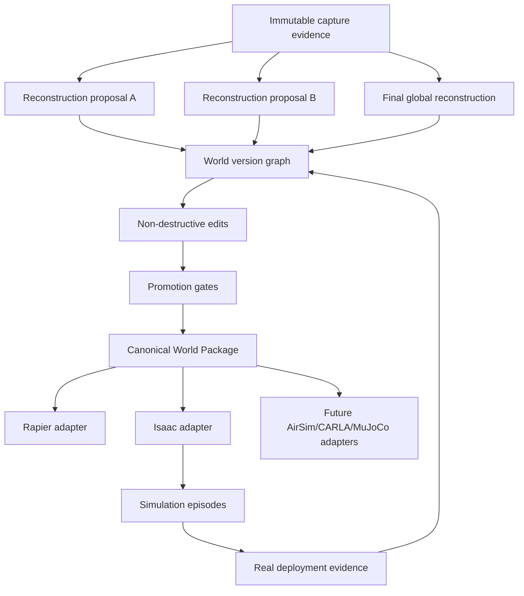

# 2. System architecture

## 2.1 Source-of-truth model

World Studio should use an **immutable evidence + derived version graph**.



A derived asset is never allowed to overwrite its source. A promotion creates a stronger assertion in a new world version.

## 2.2 Service boundaries

### CaptureSplat iPhone

Responsibilities:

- capture gating and accepted-frame decision;
- local durable write before networking;
- sensor synchronization;
- capture quality and thermal/network telemetry;
- queueing completed accepted keyframes;
- reconciliation retention.

Not responsible for:

- global reconstruction authority;
- simulator exports;
- collision promotion;
- long-lived edit history.

### World Studio Electron host on Mac

Responsibilities:

- pairing and receiver;
- strict path, size, hash, sequence, and schema validation;
- session ledger and resume;
- progressive world state and UI;
- job orchestration to local/remote workers;
- edit graph and user promotion decisions;
- canonical package creation;
- local Spark/Three.js/Rapier preview;
- simulator adapter job submission and result display.

### Reconstruction workers

- **Immediate:** ARKit/RGB-D preview and local mesh.
- **LingBot-Map:** proposal-only streaming pose/depth/confidence/point geometry.
- **i3dgs:** isolated research comparator only; immutable inputs/outputs; never required by shipped product without commercial rights.
- **Final:** global COLMAP/3DGS and geometry workers on local NVIDIA Linux or remote GPU.
- **Optional priors:** NOVA3R or related amodal methods as proposals, never automatic collider authority.
- **Semantic QA:** local MLX VLM/grounding on Apple Silicon as labels, QA, and affordance proposals.

### Simulator workers

- Isaac worker on supported NVIDIA hardware;
- future adapters with identical job semantics;
- deterministic container/image and adapter versions recorded in every output.

## 2.3 Canonical World Package

Proposed package identifier: `world_studio.world.v0.1`.

```text
my_world.wsworld/
├── manifest.json
├── evidence/
│   ├── capture_session.json
│   ├── frames/
│   ├── depth/
│   ├── confidence/
│   ├── masks/
│   ├── poses/
│   ├── calibration/
│   ├── roomplan/
│   ├── apriltag/
│   └── checksums.sha256
├── transforms/
│   ├── frame_graph.json
│   └── metric_alignment.json
├── reconstruction/
│   ├── visual/
│   │   ├── canonical_gaussians.ply
│   │   ├── delivery.spz
│   │   └── streaming.sog
│   ├── geometry/
│   │   ├── metric_mesh.glb
│   │   └── geometry_provenance.json
│   ├── collision/
│   │   ├── static_collision.glb
│   │   ├── collision_groups.json
│   │   └── approximation_report.json
│   ├── navigation/
│   │   ├── floor.glb
│   │   ├── occupancy.bin
│   │   ├── no_go_zones.json
│   │   └── clearance_report.json
│   └── checkpoints/
├── semantics/
│   ├── scene_graph.json
│   ├── observations.jsonl
│   ├── affordance_proposals.json
│   └── human_reviews.jsonl
├── physics/
│   ├── materials.json
│   ├── object_parameters.json
│   ├── uncertainty.json
│   └── calibration_runs.jsonl
├── robots/
│   └── *.robot.json
├── tasks/
│   └── *.task.json
├── variants/
│   ├── appearance.json
│   ├── layout.json
│   ├── physics.json
│   └── sensor.json
├── adapters/
│   ├── isaac/
│   │   ├── world.usda
│   │   ├── layers/
│   │   ├── compile_report.json
│   │   └── compatibility.json
│   └── rapier/
├── episodes/
│   ├── simulated/
│   └── real/
├── validation/
│   ├── latest.json
│   ├── geometry/
│   ├── sensors/
│   ├── physics/
│   └── policy/
└── history/
    ├── edits.jsonl
    ├── promotions.jsonl
    └── versions.jsonl
```

The package may be a directory during development and a content-addressed archive for transport. Large assets should support external object-store URIs while retaining hashes in the manifest.

## 2.4 Authority model

| Layer | Default authority | How it is promoted | What must never happen automatically |
|---|---|---|---|
| Raw capture | CaptureSplat ledger | reconciliation and checksum verification | derived worker modifies it |
| Camera calibration | device + validated calibration record | reprojection/physical validation | silent convention or unit changes |
| Coordinate frame/scale | explicit frame graph | AprilTag/known distance/RoomPlan/COLMAP gated alignment | separate mesh/splat transforms drift apart |
| Visual appearance | canonical Gaussian/mesh view | visual QA | used as collision or range measurement by default |
| Metric geometry | RGB-D/validated reconstruction | physical scale and surface tests | promoted because it “looks right” |
| Collision | simplified/grouped mesh or primitives | penetration, coverage, clearance, route tests | raw splat or noisy scan used directly |
| Navigation | occupancy/heightfield/navmesh | robot-profile clearance and path tests | one nav product reused for all embodiments |
| Semantics | model proposals with evidence | cross-view consistency or human review | labels become physics behavior without review |
| Affordances | task-specific proposal | objectization + interaction test | “door” label automatically means openable |
| Physics parameters | measured, catalogued, or inferred ranges | matched interaction calibration | point estimates presented as measured truth |
| Dynamics | simulator model | matched open-loop real/sim sequence | visual animation treated as physical validation |
| Task success | task evaluator | repeatable episode contract | UI appearance used as success evidence |

## 2.5 Representation stack

### Appearance layer

- canonical high-quality Gaussian PLY;
- SPZ for compact delivery;
- SOG/streamed form for large scenes;
- optional textured meshes for compatibility;
- lighting and exposure metadata separated from geometry.

### Static structural layer

- RGB-D TSDF/Poisson baseline;
- multi-view depth/fusion workers;
- explicit floor/wall/ceiling candidates;
- metric coverage and uncertainty map.

### Collision layer

Produce task-specific approximations:

- static triangle mesh for room shell where supported;
- simplified collision mesh;
- primitives for simple structures;
- convex hull/decomposition for movable rigid objects;
- heightfield/occupancy for mobility;
- no-go zones and safety inflation based on robot footprint.

### Interactive object layer

A captured room should be split into:

1. immutable/static background;
2. movable rigid objects;
3. articulated objects;
4. deformable/unsupported objects;
5. visual-only clutter;
6. safety-critical geometry.

Interactive objects should generally be **objectized** and replaced or augmented with clean simulator assets. Keep an alignment link back to the captured appearance.

### Semantic layer

Each object record should contain:

- stable world object ID;
- label candidates and evidence views;
- 3D bounds and mask/point provenance;
- parent/support/container relationships;
- task-relevant affordance proposals;
- simulator asset association;
- confidence and review state.

### Physics layer

Represent values as distributions/ranges plus provenance:

```json
{
  "parameter": "static_friction",
  "value": 0.62,
  "range": [0.50, 0.74],
  "unit": "dimensionless",
  "source_type": "matched_experiment",
  "source_id": "episode_real_0042",
  "confidence": 0.81,
  "approved_for": ["mobile_navigation"],
  "not_approved_for": ["precision_manipulation"]
}
```

## 2.6 Transform and unit discipline

Set these invariants:

- canonical units: meters, seconds, kilograms, radians;
- canonical world basis declared in manifest;
- every imported convention has a named transform edge;
- camera pose convention includes direction (`camera_to_world` or `world_to_camera`) and basis;
- visual, metric, collision, semantics, and simulator outputs reference the same transform IDs;
- no ad-hoc `-90°` fixes in UI code without an authored transform record;
- transforms have tests using known points, axes, gravity direction, and round-trips.

## 2.7 Progressive session state

The UI should expose a state machine:

```text
CREATED
 -> PAIRING
 -> RECEIVING
 -> RECONCILING
 -> EVIDENCE_COMPLETE
 -> PREVIEW_AVAILABLE
 -> GEOMETRY_PROPOSED
 -> VISUAL_PROPOSED
 -> GLOBAL_RECONSTRUCTION_RUNNING
 -> WORLD_DRAFT
 -> VALIDATING
 -> PROMOTED
 -> COMPILED
 -> SIMULATING
 -> FIELD_RECONCILIATION
 -> SUPERSEDED
```

Workers can fail independently. A failed high-quality reconstruction must not destroy the immediate preview or evidence.

## 2.8 Job and event model

Use explicit immutable jobs:

- `capture.replay`
- `reconstruction.lingbot`
- `reconstruction.colmap`
- `reconstruction.gaussian`
- `geometry.tsdf`
- `geometry.collision`
- `semantics.inspect`
- `world.validate`
- `adapter.isaac.compile`
- `adapter.isaac.run`
- `adapter.isaac.evaluate`
- `world.reconcile_real_episode`

Every job records:

- input artifact hashes;
- image/container/model/commit versions;
- deterministic seed where applicable;
- hardware summary;
- logs and metrics;
- outputs and hashes;
- status and reason codes;
- parent job and world version.

## 2.9 Local preview versus authoritative simulation

### Spark + Three.js + Rapier

Use for:

- immediate visual feedback;
- editor interaction;
- camera and semantic overlays;
- collision inspection;
- quick navigation/clearance preview;
- browser/WebXR review;
- low-cost deterministic replay.

Do not market it as final robotics physics. Rapier is a useful local backend, while the canonical world and validation reports remain independent.

### External simulator adapters

Use for:

- authoritative simulator-specific physics/sensors;
- robot ecosystem and controller integration;
- large-scale policy rollouts;
- runtime-specific regression tests.

The adapter consumes the World Package; it does not own it.
