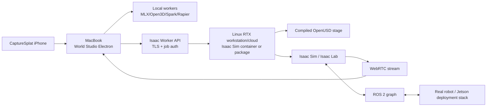

# 3. NVIDIA Isaac Sim and Isaac Lab integration

## 3.1 Why Isaac integration is necessary

Isaac should be the first high-fidelity adapter because it supplies the expensive execution capabilities World Studio should not rebuild:

1. **Physics and contacts:** static/rigid/articulated simulation, materials, mass, collision, sensors, and debugging.
2. **OpenUSD composition:** a structured way to combine visual, collision, semantics, robots, tasks, and overrides non-destructively.
3. **Robot ecosystem:** URDF/MJCF/USD assets, controllers, motion tooling, and SimReady content.
4. **Sensor simulation:** RGB/depth, RTX LiDAR/radar, IMU, contact, raycast, and proximity families.
5. **ROS 2 parity:** connect the same topics, transforms, QoS, controllers, Nav2, and MoveIt-style workflows used by real robots.
6. **Synthetic data and variation:** Replicator and related randomization/annotation workflows.
7. **Training and evaluation scale:** Isaac Lab supports RL/IL and parallel environments; Isaac Lab-Arena points toward composable policy evaluation.
8. **Industry credibility:** customers using the NVIDIA stack can consume World Studio worlds without adopting a new physics runtime.

Isaac integration changes World Studio from a convincing 3D editor into an actionable robotics platform.

## 3.2 The crucial architectural proof

NVIDIA’s official World Labs Marble-to-Isaac workflow already uses two artifacts:

```text
Gaussian PLY -> NuRec USDZ -> visual volume
Collider GLB -> imported/aligned -> physics collision
```

That validates World Studio’s dual-artifact rule. The opportunity is to automate and generalize the manual parts:

- generate both representations from captured evidence;
- maintain one metric transform graph;
- compile them into layered USD;
- validate alignment and collisions;
- add semantics, robots, sensors, tasks, and variants;
- retain a backend-neutral source package.

## 3.3 Hardware and deployment topology

As of 29 July 2026, the current public release is Isaac Sim **6.0.1 (June 2026)**. Full Isaac Sim is distributed for Linux and Windows. macOS receives the WebRTC streaming client, not the full simulator. NVIDIA’s current requirements list x86_64 RTX workstation-class hardware; the aarch64 build is currently supported only on DGX Spark, not Jetson.

Therefore use this topology:



### Jetson Orin Nano’s role

Treat the Jetson Orin Nano as an **edge deployment and robot-side inference target**, not as the primary Isaac Sim host. Use the workstation/cloud GPU to simulate/train; deploy optimized policy/perception/control components to Jetson; compare robot logs against the exact simulated episode contract.

## 3.4 Version policy

Start with a tested matrix, not an unbounded “latest” dependency:

```yaml
isaac_sim:
  supported: ["6.0.1"]
  default: "6.0.1"
isaac_lab:
  supported: ["3.0.0-beta2"]
  default: "3.0.0-beta2"
  maturity: "research adapter"
ros2:
  supported: ["Jazzy", "Humble"]
  default: "Jazzy"
nurec:
  maturity: "experimental"
  required: false
```

Isaac Lab’s current repository maps the `release/3.0.0-beta2` branch to Isaac Sim 6.0.0/6.0.1. Keep Lab behind an adapter capability flag until its selected version passes the project’s regression suite.

## 3.5 OpenUSD compilation design

Use OpenUSD composition instead of flattening everything into one opaque file. Layers allow sparse, reversible overrides; references and payloads support modular assets and large working sets; variants support controlled alternatives.

Recommended stage:

```text
adapters/isaac/
├── world.usda                 # composition only; default prim and metadata
├── layers/
│   ├── 00_frame.usda          # units, up-axis, root transform, georeference
│   ├── 10_visual.usda         # NuRec volume or visual mesh fallback
│   ├── 20_collision.usda      # static colliders and collision groups
│   ├── 30_semantics.usda      # semantic labels and object IDs
│   ├── 40_physics.usda        # materials, mass, joints, parameter ranges selected
│   ├── 50_navigation.usda     # floor, no-go, spawn/goal markers
│   ├── 60_robots.usda         # robot references and sensor mounts
│   ├── 70_task.usda           # task entities, success/failure regions
│   ├── 80_randomization.usda  # variant sets and distributions
│   └── 90_session.usda        # strongest ephemeral run overrides
├── assets/
│   ├── visual.usdz
│   ├── static_collision.usd
│   └── objects/
├── config/
│   ├── ros2_graph.json
│   ├── sensors.json
│   ├── task.json
│   └── randomization.json
└── compile_report.json
```

Suggested root composition:

```usda
#usda 1.0
(
    defaultPrim = "World"
    metersPerUnit = 1
    upAxis = "Z"
    subLayers = [
        @./layers/00_frame.usda@,
        @./layers/10_visual.usda@,
        @./layers/20_collision.usda@,
        @./layers/30_semantics.usda@,
        @./layers/40_physics.usda@,
        @./layers/50_navigation.usda@,
        @./layers/60_robots.usda@,
        @./layers/70_task.usda@,
        @./layers/80_randomization.usda@,
        @./layers/90_session.usda@
    ]
)

def Xform "World" {}
```

Do not hard-code this exact layer order without tests; USD opinion strength and composition behavior must be explicitly exercised in unit tests.

## 3.6 Visual path

### Canonical representation

Keep PLY/SPZ/SOG in the World Package as canonical visual assets.

### Isaac projection

Optional worker path:

```text
canonical_gaussians.ply
    -> NVIDIA 3DGRUT / NuRec conversion
    -> visual.usdz
    -> NuRec volume prim in Isaac
```

Important constraints:

- conversion runs on supported Linux/NVIDIA hardware;
- NuRec utilities in Isaac Sim 6.0.1 are documented as experimental;
- APIs/formats may change;
- the adapter must pin versions and produce a compile report;
- retain a visual-mesh fallback and never make NuRec the only usable path;
- render-reference regression tests should compare known cameras against source evidence.

## 3.7 Collision and physics path

```text
validated metric geometry
    -> segmentation / cleanup
    -> task-specific collision approximation
    -> GLB/USD mesh or primitives
    -> collision API/preset
    -> material and rigid-body properties
    -> debug and validation suite
```

Rules:

- static room shell and dynamic objects are separate prim groups;
- dynamic objects do not inherit one giant non-convex room collider;
- select mesh, primitive, convex hull, or convex decomposition based on the task;
- visual geometry may be hidden while collision remains enabled;
- every collision prim retains `world_object_id` and source artifact hash;
- robot-footprint clearance and contact tests run before promotion;
- mass and inertia are authored only for dynamic bodies;
- physics parameters reference approved ranges and calibration evidence.

## 3.8 Isaac extension

Build a small extension, tentatively:

```text
exts/capturesplat.world_studio/
├── config/extension.toml
├── capturesplat/world_studio/__init__.py
├── capturesplat/world_studio/extension.py
├── capturesplat/world_studio/importer.py
├── capturesplat/world_studio/validator.py
├── capturesplat/world_studio/ros2_builder.py
├── capturesplat/world_studio/task_builder.py
├── capturesplat/world_studio/episode_recorder.py
└── tests/
```

Responsibilities:

1. open a World Package manifest;
2. validate schema, hashes, relative paths, units, and transform graph;
3. compile or open the USD stage;
4. apply collision/physics/semantic schemas;
5. attach robot and sensor profile;
6. construct ROS 2 OmniGraph or Python bridge configuration;
7. create task success/failure evaluators;
8. run preflight checks;
9. record episode metadata and output hashes;
10. return structured results to World Studio.

The extension should be thin. General world logic belongs in backend-neutral libraries.

## 3.9 Worker API

Use a job API separate from ROS 2:

```http
POST /v1/isaac/jobs
GET  /v1/isaac/jobs/{job_id}
POST /v1/isaac/jobs/{job_id}/cancel
GET  /v1/isaac/jobs/{job_id}/artifacts
GET  /v1/isaac/capabilities
GET  /health
```

Job actions:

- `compile`
- `validate`
- `run_episode`
- `run_batch`
- `evaluate_policy`
- `render_reference_views`
- `export_synthetic_dataset`

Use signed URLs or mounted content-addressed storage for large assets. The API must return machine-readable reason codes, not only logs.

## 3.10 ROS 2 boundary

ROS 2 is the robot I/O compatibility boundary, not the World Studio file transfer protocol.

Use ROS 2 for:

- `/clock` and simulation time;
- TF tree and odometry;
- camera/depth/LiDAR/IMU/contact topics;
- `cmd_vel`, Ackermann, joint controllers, and actions;
- Nav2 or MoveIt integration;
- policy deployment parity;
- recording and replay with rosbag2 when appropriate.

Do not use ROS 2 for:

- iPhone keyframe upload;
- World Package artifact transfer;
- long-running cloud job orchestration;
- edit graph synchronization.

This separation allows capture to remain simple and reliable while robot interfaces remain standard.

## 3.11 Isaac Lab adapter

The Isaac Lab adapter maps World Studio abstractions into training/evaluation configuration:

| World Studio | Isaac Lab concept |
|---|---|
| World Package | scene/environment assets |
| Robot profile | articulation/actuator/sensor configuration |
| Task profile | observations, actions, rewards, termination, curriculum |
| Variant distributions | events/domain randomization |
| Episode contract | reset, seed, initial conditions, success/failure |
| Evaluation matrix | environment clones, policies, checkpoints, seeds |
| Field residuals | updated parameter distributions/curriculum |

Generate code/configuration; do not bury task logic in the Electron app.

Recommended output:

```text
adapters/isaac_lab/generated/<world>/<task>/
├── scene_cfg.py
├── robot_cfg.py
├── task_cfg.py
├── observations.py
├── rewards.py
├── terminations.py
├── events.py
├── evaluation.yaml
└── provenance.json
```

For initial mobile navigation, prioritize evaluation and controller parity over RL training. Training can follow after the world and sensor validation suite is credible.

## 3.12 Randomization policy

Do not randomize everything blindly. Use three classes:

1. **Measured variation:** observed in repeated captures or field logs.
2. **Calibrated uncertainty:** parameter range fitted from real/sim comparisons.
3. **Stress variation:** intentionally outside observed range, clearly labeled OOD.

Variant axes may include:

- lighting/exposure and material appearance;
- clutter visibility and object pose;
- floor friction and wheel slip;
- robot initial pose and battery/motor state;
- sensor extrinsics, latency, noise, dropout;
- navigation obstacle placement;
- camera viewpoint;
- dynamic agent trajectories.

Every episode records exact sampled values and seed.

## 3.13 Licensing and product delivery

NVIDIA’s June 2026 Isaac Sim license FAQ states:

- internal R&D use is free;
- selling only custom Python/USD assets that customers run in their own Isaac environment does not require NVIDIA AI Enterprise;
- selling simulation outputs alone does not require it;
- redistributing Isaac Sim/Omniverse Kit or delivering it as a turnkey third-party service requires an NVIDIA AI Enterprise license.

Therefore the lowest-friction commercial architecture is:

- World Studio sells/exports the World Package, USD assets, adapter code, validation reports, and optionally internally generated outputs;
- customers run Isaac in their own environment;
- a hosted Isaac service is a separate commercial/licensing decision.

This is an engineering interpretation, not legal advice; verify the applicable terms before launch.
