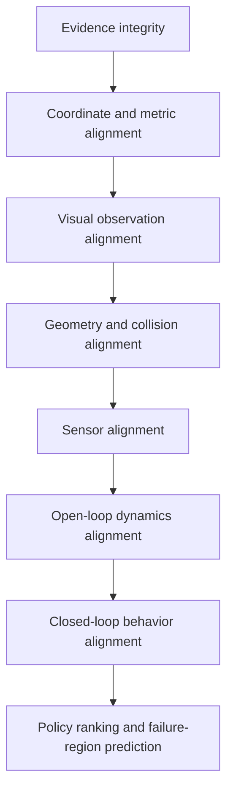

# 4. Validation and the real-to-sim-to-real loop

## 4.1 The target is decision alignment

A simulation does not need identical aggregate success percentages to be useful. It needs to support the same decisions as reality:

- identify success and failure regions;
- preserve the relative ranking of policies/checkpoints;
- reveal regressions;
- guide what data or variations should be generated next;
- decide which candidates deserve expensive hardware tests.

This should become World Studio’s north-star metric.

## 4.2 Validation pyramid



Do not attempt upper levels before lower levels pass.

## 4.3 Evidence integrity checks

- all accepted frame sequence IDs accounted for;
- file length and SHA-256 match;
- timestamps monotonic within declared behavior;
- camera/depth/mask associations valid;
- intrinsics and resolution consistent or versioned;
- no unsafe relative paths or duplicate identity collision;
- resume/retry tests do not duplicate logical frames;
- final phone and receiver manifests reconcile.

## 4.4 Coordinate and geometry checks

Recommended configurable initial gates for indoor navigation, to be tuned from measured data:

| Check | Proposed initial gate | Notes |
|---|---:|---|
| Known-distance scale error | ≤ 1% | use AprilTags or measured baseline |
| Gravity/up-axis error | ≤ 0.5° | compare ARKit/IMU/floor plane |
| Floor plane residual | ≤ 10 mm RMS in validated region | stricter only with better depth |
| Static collision surface error | ≤ 20 mm median in navigable region | task-specific, not universal |
| Splat-to-collider registration | ≤ 20 mm median on structural samples | also inspect tails/max |
| Coverage | ≥ 95% of declared navigable surface | exclude unknown/occluded regions explicitly |
| Spawn clearance | robot body + safety margin | per robot profile |

These are engineering starting targets, not externally established guarantees.

## 4.5 Visual and sensor alignment

Render matched camera views from the simulator using captured intrinsics/extrinsics. Compare:

- RGB perceptual residuals and exposure-normalized differences;
- depth error and missing-depth structure;
- semantic mask overlap;
- edge alignment around walls, floors, furniture, and small obstacles;
- LiDAR/raycast returns and hit prim IDs;
- camera latency, frame rate, rolling-shutter approximation, noise, and dropout;
- IMU/odometry statistics during controlled trajectories.

Store metrics by region and object rather than only one scene mean.

## 4.6 Collision and mobility validation

For an indoor robot/vacuum:

1. sample thousands of floor points and verify support;
2. sweep the robot collision body through free space;
3. test doorway and furniture clearances;
4. find tunnels, floating surfaces, holes, and invisible blockers;
5. compare simulated and real stopping distance on selected floor materials;
6. compare wheel slip/turn radius/odometry on a scripted route;
7. compare simulated depth/LiDAR along the same path;
8. record false-positive and false-negative collision regions.

World Studio should visualize uncertainty and failed regions directly in the editor.

## 4.7 Matched open-loop experiments

Before policy claims, apply the same action sequence in simulation and reality:

- mobile robot: fixed velocity/turn commands;
- drone: fixed thrust/attitude sequence in a safe test volume;
- rigid object: fixed push/slide/drop action;
- articulation: fixed door/drawer command or trajectory;
- manipulator: fixed joint/action sequence.

Compare:

- state trajectories;
- contact timing and locations;
- object motion;
- observations;
- final outcomes.

Use residuals to update parameter distributions, not to hide mismatch.

## 4.8 Closed-loop and policy evaluation

For each policy/checkpoint:

- run fixed ID conditions;
- run held-out OOD conditions;
- use common seeds across policies;
- run sufficient simulated repetitions;
- reserve a smaller real test set;
- compare success/failure regions, not only global rate;
- compute ranking correlation with confidence intervals;
- inspect near-boundary behavior;
- track regressions by world version.

Suggested metrics:

- Spearman/Kendall policy ranking correlation;
- failure-region overlap or spatial correlation;
- precision/recall of predicted hardware failures;
- calibration curve of simulated risk vs real failure;
- route collision and intervention rates;
- trajectory distribution distance;
- sensor residual distributions;
- sim/real outcome agreement near decision boundaries.

## 4.9 Uncertainty as a first-class artifact

Each grid cell/object/parameter can have:

- observed versus inferred state;
- source evidence count;
- view/depth coverage;
- model disagreement;
- validation status;
- task relevance;
- confidence interval;
- promotion authority and reviewer.

Example:

```json
{
  "world_object_id": "chair_07",
  "geometry": {"status": "validated", "median_error_m": 0.014},
  "collision": {"status": "promoted", "approved_for": ["mobile_navigation"]},
  "mass": {"status": "unknown"},
  "friction": {"status": "inferred", "range": [0.42, 0.71]},
  "articulation": {"status": "not_applicable"}
}
```

## 4.10 Field feedback ingestion

A real episode package should include:

```text
real_episode/
├── manifest.json
├── world_version.json
├── robot_profile.json
├── task.json
├── policy.json
├── commands/
├── tf_odometry/
├── sensors/
├── events/
├── outcome.json
├── operator_notes.json
└── checksums.sha256
```

Reconciliation flow:

```text
real episode
 -> align clocks and frames
 -> replay in current simulated world
 -> compute residuals
 -> classify cause:
      capture gap
      geometry error
      collision error
      sensor mismatch
      physics mismatch
      policy stochasticity
      world changed
 -> propose corrections
 -> human/automatic promotion gate
 -> new immutable world version
 -> re-run regression matrix
```

## 4.11 Domain rollout validation

### Indoor mobile robot / vacuum — first

- metric floor and clearance;
- static obstacles;
- wheel-floor behavior;
- RGB-D/LiDAR/IMU/odometry parity;
- Nav2/controller integration;
- route and coverage tasks.

### Indoor UAV — second

- 3D free-space and ceiling/overhang coverage;
- propeller safety inflation;
- IMU/camera/depth parity;
- airflow generally simplified initially;
- trajectory collision and localization.

### Outdoor UAV and cars — third

- global/georeferenced frames;
- scale and long-range drift;
- drivable surfaces/lanes and terrain;
- weather/lighting and dynamic agents;
- much larger streaming and LOD needs;
- vehicle dynamics and regulatory safety cases.

### Articulated task robots — last

- clean objectization;
- articulation topology and limits;
- grasp/contact surfaces;
- mass/inertia/material calibration;
- matched open-loop interaction;
- policy evaluation around failure boundaries.

### Deformables — specialized track

Cables, cloth, packaging, and soft objects should be a dedicated research/product line. Do not let them block the mobile-world platform.
